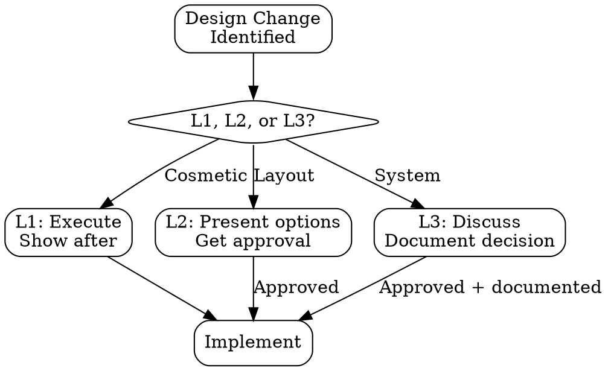

# Cross-Cutting Checks Protocol

## Overview

These 6 checklists apply across all skills and workflows. They are referenced by specific skill phases — when a skill says "Reference: CC-3", come here and complete that checklist.

| Code | Name | Type | Applies When |
|------|------|------|-------------|
| CC-1 | Context Loading | Setup | Every workflow start |
| CC-2 | Design Alignment | Decision | UI/UX changes |
| CC-3 | Tenant Isolation | HARD-GATE | Any data access code |
| CC-4 | Platform Compatibility | Checklist | Platform-related code |
| CC-5 | Financial Precision | HARD-GATE | Any money/accounting code |
| CC-6 | Knowledge Dual-Write | Delivery | Every workflow end |

---

## CC-1: Context Loading

**When:** At the start of every workflow, load relevant knowledge files.

### Loading Matrix

| Workflow Type | Knowledge to Load |
|--------------|------------------|
| Module Design | `knowledge/architecture/` + `knowledge/domain/` relevant files |
| Module Build | Design document + `templates/` relevant files |
| Platform Integration | `knowledge/platforms/platform-{name}.md` + `knowledge/platforms/platform-abstraction.md` |
| Debugging | Module's knowledge file + recent git history |
| Quality Polish | Existing UI patterns + design system conventions |
| Testing | Module's test patterns + existing test utilities |

### Checklist

- [ ] Identified workflow type
- [ ] Loaded relevant knowledge files
- [ ] Checked for recent changes to loaded knowledge (git log)
- [ ] Identified applicable skills from `skills/using-erpforge.md`

---

## CC-2: Design Alignment

**When:** Any change that affects UI/UX, visual design, or interaction patterns.

### Three-Level Framework

| Level | Scope | Examples | Action Required |
|-------|-------|---------|----------------|
| **L1 — Cosmetic** | Color, spacing, border-radius, font-size, icon swap | Change `gap-3` to `gap-2`, adjust font weight | Execute autonomously → Show result after |
| **L2 — Layout** | Component structure, interaction pattern, data layout, new component variant | Redesign filter bar, change table to card grid | Present options → Get approval → Execute |
| **L3 — System** | Design tokens, brand expression, new patterns, animation system | New color palette, motion design system | Discuss with user → Document decision → Execute |

### Decision Protocol



### When in Doubt

Default to the HIGHER level. The cost of asking is 30 seconds. The cost of rework is 30 minutes.

---

## CC-3: Tenant Isolation (HARD-GATE)

**When:** Any code that reads, writes, updates, or deletes data from the database.

### <EXTREMELY-IMPORTANT>The 6-Item Checklist</EXTREMELY-IMPORTANT>

Every data-access change MUST verify ALL 6 items:

| # | Check | How to Verify |
|---|-------|--------------|
| 1 | **Every SELECT includes `WHERE tenantId = ?`** | Grep all new/modified queries for tenantId |
| 2 | **RLS policies exist on new tables** | Check migration file for CREATE POLICY |
| 3 | **Cross-tenant test exists** | Test: Tenant A data not visible to Tenant B |
| 4 | **JOIN queries filter tenantId on ALL joined tables** | Review every JOIN — each table in the join must be tenant-filtered |
| 5 | **Bulk operations scope to single tenant** | No bulk UPDATE/DELETE without tenantId in WHERE |
| 6 | **No raw SQL without tenant filter** | Grep for raw SQL (db.execute, sql``) — all must include tenantId |

### Common Mistakes

```sql
-- WRONG: Missing tenantId on joined table
SELECT o.*, oi.*
FROM orders o
JOIN order_items oi ON oi.order_id = o.id
WHERE o.tenant_id = $1;
-- ↑ order_items is not filtered — if RLS is off, data leaks

-- CORRECT: Both tables filtered
SELECT o.*, oi.*
FROM orders o
JOIN order_items oi ON oi.order_id = o.id AND oi.tenant_id = $1
WHERE o.tenant_id = $1;
```

### Failure Protocol

If ANY item is unchecked → **STOP**. Fix the isolation gap before proceeding. Tenant data leakage is a critical security issue — it is never deferred.

---

## CC-4: Platform Compatibility

**When:** Code that processes data from or sends data to e-commerce platforms.

### 5-Item Checklist

| # | Check | What to Verify |
|---|-------|---------------|
| 1 | **Field names verified with real API response** | Not from documentation alone (AR-1, AR-6) |
| 2 | **Error code mapping correct** | Upstream 401 → 502, not pass-through |
| 3 | **Rate limiting handled** | Per-platform limits respected, backoff implemented |
| 4 | **Null/missing fields handled** | Platform may omit fields that docs say are required |
| 5 | **Platform quirks documented** | New discoveries added to `knowledge/platforms/` |

### Platform-Specific Considerations

Different platforms have different behaviors for the "same" concept:

| Concept | May Vary By Platform |
|---------|---------------------|
| Order status names | "Shipped" vs "Dispatched" vs "InTransit" |
| Price format | Cents (integer) vs dollars (decimal) vs object `{value, currency}` |
| Date format | ISO 8601 vs Unix timestamp vs custom string |
| Pagination | Cursor vs offset vs token vs link header |
| Auth token lifetime | 1 hour vs 24 hours vs never expires |

Never assume one platform works like another.

---

## CC-5: Financial Precision (HARD-GATE)

**When:** Any code that handles money, prices, costs, exchange rates, or accounting entries.

### <EXTREMELY-IMPORTANT>The 5-Item Checklist</EXTREMELY-IMPORTANT>

| # | Check | What to Verify |
|---|-------|---------------|
| 1 | **Debits equal credits** | Every journal entry balances to zero |
| 2 | **No floating-point arithmetic for money** | Use `numeric`/`decimal` in DB, string-based math in JS (e.g., `decimal.js`) |
| 3 | **Currency-appropriate precision** | USD: 2 decimals, JPY: 0 decimals, BTC: 8 decimals |
| 4 | **Exchange rates applied correctly** | Rate × amount, correct rounding direction |
| 5 | **Display precision matches storage** | No showing `$10.0` or `$10.999` |

### Common Mistakes

```typescript
// WRONG: Floating-point arithmetic
const total = price * quantity; // 0.1 + 0.2 = 0.30000000000000004

// CORRECT: Decimal library
import Decimal from 'decimal.js';
const total = new Decimal(price).times(quantity).toFixed(2);

// WRONG: Storing calculated totals redundantly
// If items change, total doesn't update

// CORRECT: Compute on read, or reconcile on write
const total = items.reduce((sum, item) =>
  sum.plus(new Decimal(item.price).times(item.quantity)),
  new Decimal(0)
);
```

### Failure Protocol

If ANY item is unchecked → **STOP**. Financial bugs are the most expensive bugs — they affect trust, compliance, and real money.

---

## CC-6: Knowledge Dual-Write

**When:** At the end of every workflow that changes code, architecture, or domain understanding.

### The Dual-Write Rule

**When you change code, you MUST also update the corresponding knowledge file in the same session.**

"I'll update docs later" = "I won't update docs" (Reference: AR-11)

### Update Matrix

| Change Type | Knowledge File to Update |
|-------------|------------------------|
| New module created | Architecture docs — module overview, boundaries, API |
| New API endpoints | API documentation — endpoints, request/response schemas |
| New state machine | Domain docs — state diagram, transition rules, side effects |
| Platform quirk discovered | `knowledge/platforms/platform-{name}.md` — quirks section |
| Schema change | Data model documentation |
| New design pattern | Architecture docs — pattern description, when to use |
| Bug fix (non-trivial) | Troubleshooting knowledge or quirks file |
| New UI pattern | UI/design documentation |

### Checklist

- [ ] Identified what knowledge changed
- [ ] Found the corresponding knowledge file
- [ ] Updated the file (or created a new one if none exists)
- [ ] Verified the update with `git diff`

### What NOT to Dual-Write

- Trivial code fixes (typo corrections, simple refactors)
- Changes already covered by existing documentation
- Temporary debugging changes that will be reverted

---

## Quick Reference Card

When any skill references a CC check, use this card:

```
CC-1: Did I load context?           → Knowledge files for this workflow type
CC-2: Is this a design decision?    → Classify L1/L2/L3, act accordingly
CC-3: Does this touch data?         → 6-item tenant isolation checklist
CC-4: Does this touch a platform?   → 5-item compatibility checklist
CC-5: Does this touch money?        → 5-item financial precision checklist
CC-6: Am I done?                    → Update knowledge files in same session
```

---

*Cross-cutting concerns are easy to forget and expensive to fix. The checklists exist so you don't have to remember — you just have to check.*
