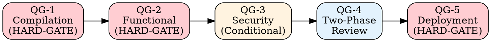
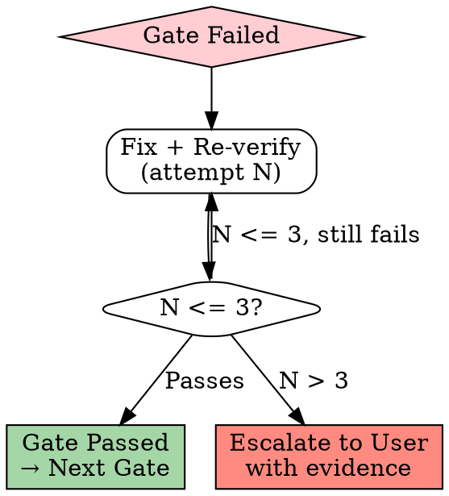

# Quality Gates Protocol

## Overview

Every deliverable passes through up to 5 quality gates. Gates are checkpoints — work cannot proceed until the gate's criteria are met. HARD-GATEs are mandatory and cannot be skipped under any circumstances.

---

## QG-1: Compilation Gate (HARD-GATE)

**Purpose:** Ensure code is syntactically and type-safe before any functional testing.

### Checks

| # | Check | Command | Pass Criteria |
|---|-------|---------|---------------|
| 1 | TypeScript compiles | `npx tsc --noEmit` | Zero errors |
| 2 | No type escape hatches | Grep new code | Zero `as any` |
| 3 | No suppression comments | Grep new code | Zero `@ts-ignore` / `@ts-expect-error` |
| 4 | No empty catch blocks | Grep new code | Zero `catch {}` or `catch (e) {}` without handling |
| 5 | No console.log in production code | Grep new code | Zero `console.log` (use logger instead) |

### Pass / Fail

- **Pass:** All 5 checks return zero matches / zero errors → Proceed to QG-2
- **Fail:** Any check fails → Fix before proceeding. No exceptions.

### Why This Is a HARD-GATE

`as any` and `@ts-ignore` defeat the purpose of TypeScript. They are band-aids that hide bugs. If a type doesn't fit, fix the type — don't silence the compiler.

---

## QG-2: Functional Verification Gate (HARD-GATE)

**Purpose:** Prove that the code actually works, not just compiles.

### Checks

| # | Check | Method | Evidence Required |
|---|-------|--------|-------------------|
| 1 | API endpoints respond correctly | `curl` each endpoint | Full request + response (status + body) |
| 2 | Error cases return proper errors | `curl` with bad input | Error response with correct status code |
| 3 | Frontend pages render | Browser verification | Page loads without errors |
| 4 | Frontend interacts correctly | Browser interaction | Actions produce expected results |
| 5 | All tests pass | `npm test` | Output with pass/fail counts |
| 6 | No regressions | `npm test` (full suite) | All pre-existing tests still pass |

### Pass / Fail

- **Pass:** All applicable checks pass with fresh evidence → Proceed to QG-3
- **Fail:** Any check fails → Fix and re-verify. Dev-QA loop applies (max 3 attempts → escalate).

### Evidence Freshness

Evidence must be from AFTER the latest code change. Stale evidence is not evidence.

### Why This Is a HARD-GATE

Reference: `skills/anti-rationalization.md` AR-2 — "tsc passes, feature complete" is the most common rationalization. Compilation proves syntax. Only functional testing proves behavior.

---

## QG-3: Security Gate (Conditional)

**Purpose:** Verify security-sensitive code doesn't introduce vulnerabilities.

### Trigger Conditions

This gate activates when the change involves:
- Authentication or authorization logic
- Payment processing or financial transactions
- Token handling (JWT, OAuth, API keys)
- User input that reaches database queries
- File upload or download
- External API communication with credentials

If none of these apply, skip to QG-4.

### Checks

| # | Check | What to Verify |
|---|-------|---------------|
| 1 | Tenant isolation | CC-3 checklist (all 6 items) — `protocols/cross-cutting-checks.md` |
| 2 | Input validation | All user inputs validated before processing |
| 3 | SQL injection | Parameterized queries only — no string concatenation |
| 4 | Authentication | Protected routes require valid auth token |
| 5 | Authorization | Users can only access their own tenant's data |
| 6 | Secret handling | No credentials in code, environment variables used |
| 7 | Dependency audit | `npm audit` — no high/critical vulnerabilities |

### Pass / Fail

- **Pass:** All applicable checks verified → Proceed to QG-4
- **Fail:** Any security issue found → Fix immediately. Security issues are never deferred.

---

## QG-4: Two-Phase Code Review

**Purpose:** Ensure both spec compliance and code quality.

### Phase A: Spec Compliance ("Did we build what was specified?")

| # | Check | Question |
|---|-------|----------|
| 1 | Completeness | Does the implementation cover all specified requirements? |
| 2 | Data model | Does the schema match the approved design? |
| 3 | API contract | Do endpoints match the approved API specification? |
| 4 | State machine | Are all specified transitions implemented? |
| 5 | Edge cases | Are specified edge cases handled? |

**Scoring:** Each item is Yes/No. All must be Yes.

### Phase B: Code Quality ("Did we build it well?")

| # | Dimension | What to Evaluate |
|---|-----------|-----------------|
| 1 | Readability | Clear names, logical structure, appropriate comments |
| 2 | Maintainability | Single responsibility, minimal coupling, testable |
| 3 | Performance | No N+1 queries, appropriate indexes, no unnecessary computation |
| 4 | Error handling | All failure modes handled, meaningful error messages |
| 5 | Consistency | Follows established patterns in the codebase |

**Scoring:** 1-10 per dimension. Target: all dimensions >= 7.

### Pass / Fail

- **Pass:** Phase A all Yes + Phase B all >= 7 → Proceed to QG-5
- **Fail:** Phase A has any No → Implement missing requirements. Phase B has any < 7 → Refactor.

---

## QG-5: Deployment Gate (HARD-GATE)

**Purpose:** Ensure the deliverable is safe to deploy to production.

### Checks

| # | Check | What to Verify | Evidence |
|---|-------|---------------|----------|
| 1 | CI passes | All CI pipeline checks green | CI output |
| 2 | Migration ready | DB migration runs cleanly on fresh DB | Migration output |
| 3 | Migration reversible | Rollback migration works | Down migration output |
| 4 | Health check | Application starts and responds to health endpoint | `curl /health` response |
| 5 | Logs clean | No unexpected errors or warnings in startup logs | Log output |
| 6 | Environment config | All required env vars documented | Env template updated |

### Pass / Fail

- **Pass:** All 6 checks pass with evidence → Ready for deployment
- **Fail:** Any check fails → Fix before deploying. No "deploy and fix in production."

### Why This Is a HARD-GATE

A failed deployment affects all users, all tenants, and potentially all platforms. The cost of a bad deployment is orders of magnitude higher than the cost of verifying before deploying.

---

## Gate Failure Protocol

When any gate fails:

**Escalation package must include:**
1. What was attempted (each fix attempt)
2. What failed and why
3. Evidence of each failure
4. Proposed alternative approaches

---

## Quick Reference

| Gate | Type | When | Key Question |
|------|------|------|-------------|
| QG-1 | HARD-GATE | After code changes | Does it compile cleanly? |
| QG-2 | HARD-GATE | After QG-1 | Does it actually work? |
| QG-3 | Conditional | Security-related changes | Is it secure? |
| QG-4 | Always | Before delivery | Is it complete and well-built? |
| QG-5 | HARD-GATE | Before deployment | Is it safe to deploy? |

---

*Quality gates are not bureaucracy. They are the minimum standard for professional software delivery.*
