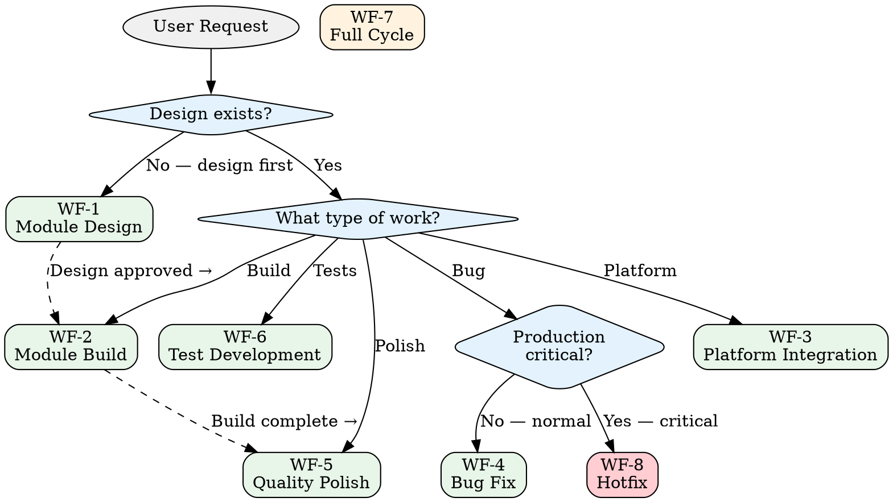
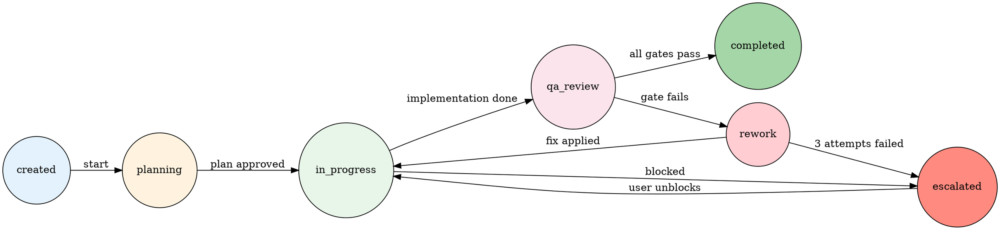

# Workflow Orchestration Protocol

## Overview

Every ERP development task follows one of 8 workflow types. Each workflow chains specific skills in a defined sequence. This protocol governs how workflows start, chain, recover from failure, and escalate.

---

## The 8 Workflow Types

| # | Workflow | Trigger | Primary Skill Chain |
|---|---------|---------|-------------------|
| 1 | **Module Design** | "Design a new module/feature/entity" | `erp-module-design` |
| 2 | **Module Build** | "Build/implement {approved design}" | `fullstack-module-build` → `quality-polish` |
| 3 | **Platform Integration** | "Integrate {platform} API" | `platform-integration` → `quality-polish` |
| 4 | **Bug Fix** | "Fix {bug/error/issue}" | `systematic-debugging` → `verification-before-completion` |
| 5 | **Quality Polish** | "Polish/refine/improve UI of {module}" | `quality-polish` |
| 6 | **Test Development** | "Add tests for {module/feature}" | `test-driven-development` |
| 7 | **Full Cycle** | "Design and build {module}" | `erp-module-design` → `fullstack-module-build` → `quality-polish` |
| 8 | **Hotfix** | "Critical production issue" | `systematic-debugging` → `verification-before-completion` (expedited) |

### Workflow Selection



---

## Workflow State Machine

Every workflow instance transitions through these states:



### State Definitions

| State | Description | Allowed Actions |
|-------|-------------|----------------|
| `created` | Workflow initialized, not yet started | Start planning |
| `planning` | Loading context, identifying skills, creating plan | Approve plan, modify plan |
| `in_progress` | Actively implementing the current phase | Continue, flag blocker |
| `qa_review` | Running quality gates (QG-1 through QG-5) | Pass gate, fail gate |
| `completed` | All gates passed, deliverable ready | Archive, start next workflow |
| `rework` | A gate failed, fixing issues | Apply fix, escalate |
| `escalated` | Blocked or 3+ rework attempts, needs user input | User resolves |

---

## Skill Chain Sequencing

### Sequential Chains

Some workflows chain skills in strict sequence:

```
WF-2 Module Build:
  fullstack-module-build (Phase 1-5)
    → quality-gates (QG-1 through QG-5)
    → quality-polish (if user requests)
    → verification-before-completion

WF-3 Platform Integration:
  platform-integration (Phase 1-5)
    → quality-gates (QG-1 through QG-5)
    → quality-polish (if user requests)
    → verification-before-completion

WF-7 Full Cycle:
  erp-module-design
    → [USER APPROVAL GATE]
    → fullstack-module-build
    → quality-gates
    → quality-polish
    → verification-before-completion
```

### Parallel Skills

Some skills run in parallel with all workflows:

- `test-driven-development` — Active during any implementation phase
- `anti-rationalization` — Active at all times, referenced by all skills

### Cross-Cutting Checks

At specific points in every workflow:

| Point | Cross-Cutting Check |
|-------|-------------------|
| Workflow start | CC-1 Context Loading |
| Any design decision | CC-2 Design Alignment |
| Any data access code | CC-3 Tenant Isolation |
| Any platform code | CC-4 Platform Compatibility |
| Any financial code | CC-5 Financial Precision |
| Workflow end | CC-6 Knowledge Dual-Write |

Reference: `protocols/cross-cutting-checks.md`

---

## Fallback Protocol

### Same-Workflow Fallback

When a phase fails within a workflow:

```
Phase N fails
  → Diagnose failure (systematic-debugging)
  → Fix attempt 1 → Re-verify phase N
  → Fix attempt 2 → Re-verify phase N
  → Fix attempt 3 → Re-verify phase N
  → ESCALATE to user
```

### Workflow Switch

Sometimes the right response to a failure is switching to a different workflow:

| Situation | Switch From | Switch To |
|-----------|------------|-----------|
| Build reveals design flaw | WF-2 Module Build | WF-1 Module Design |
| Bug found during build | WF-2 Module Build | WF-4 Bug Fix → Resume WF-2 |
| Platform quirk discovered | WF-3 Platform Integration | WF-4 Bug Fix (mini) → Resume WF-3 |
| Polish reveals missing feature | WF-5 Quality Polish | WF-2 Module Build → Resume WF-5 |

### Switch Protocol

1. **Pause** current workflow (save state: which phase, what's done)
2. **Start** the new workflow (with context from the paused one)
3. **Complete** the new workflow
4. **Resume** the original workflow from where it paused

---

## Escalation Matrix

### When to Escalate

| Trigger | Escalation Level |
|---------|-----------------|
| 3 fix attempts failed on same issue | Escalate to user |
| Expert agents disagree on approach | Escalate to user |
| Security vulnerability discovered | Escalate to user immediately |
| Design flaw discovered during build | Escalate to user (design authority) |
| Scope creep detected | Escalate to user |
| Dependency blocker (external service, API access) | Escalate to user |

### Escalation Package

Every escalation must include:

```markdown
## Escalation: {Brief Description}

### What happened
{1-2 sentences describing the situation}

### What was tried
1. Attempt 1: {what} → {result}
2. Attempt 2: {what} → {result}
3. Attempt 3: {what} → {result}

### Why it's blocked
{Root cause analysis — why attempts failed}

### Proposed options
A. {Option A} — Pros: ... Cons: ...
B. {Option B} — Pros: ... Cons: ...
C. {Option C} — Pros: ... Cons: ...

### Recommendation
{Which option and why}
```

### User Response Handling

After escalation, the user may:

| User Response | Action |
|--------------|--------|
| Selects an option | Implement that option, resume workflow |
| Provides new information | Incorporate and retry |
| Changes scope | Adjust plan and resume |
| Defers decision | Park the workflow, move to next task |

---

## Hotfix Workflow (WF-8) Special Rules

Hotfixes have expedited gates but the same quality bar:

| Normal Workflow | Hotfix Workflow |
|----------------|-----------------|
| Full design phase | Skip design — go straight to diagnosis |
| Full test suite | Targeted tests for the specific fix |
| Full quality polish | Skip polish — ship the fix |
| QG-1 through QG-5 | QG-1 + QG-2 + QG-5 (skip QG-3 unless security, skip QG-4) |

**What does NOT change in hotfix:**
- Root cause must be located (no blind fixes)
- Fix must be verified with fresh evidence
- Tenant isolation must not be compromised
- Full test suite must pass (even if not all new tests required)

---

## Workflow Lifecycle Summary

```
1. TRIGGER     — User request arrives
2. CLASSIFY    — Map to workflow type (WF-1 through WF-8)
3. LOAD        — CC-1: Load context and knowledge
4. PLAN        — Identify skill chain, estimate phases
5. EXECUTE     — Follow skill chain, phase by phase
6. GATE        — Quality gates at each phase boundary
7. REWORK      — Fix failures (max 3 per gate)
8. DELIVER     — CC-6: Dual-write knowledge
9. VERIFY      — verification-before-completion
10. COMPLETE   — Archive, update status
```

---

*Orchestration is not overhead. It's the difference between a well-run factory and a pile of parts.*
