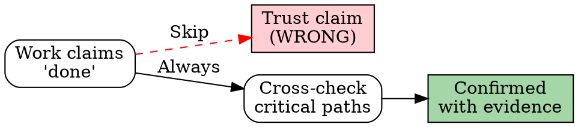

# ERP Delivery Risks & Prevention

Common pitfalls in cross-border e-commerce ERP development, distilled from production incidents.

---

## The 12 Delivery Risks

These are the most common ways ERP projects fail in production. Each one has caused real damage in cross-border e-commerce systems.

| # | Risk | What Goes Wrong | Prevention | Real Case |
|---|------|----------------|------------|-----------|
| 1 | Field mapping from docs only | Platform API docs are frequently wrong; field names differ between sandbox and production | Verify every field mapping with a real API response before writing mapping code | A logistics provider's docs said `deliveryMethod` but the actual API returned `deliveryWay` — broke all shipment creation for 2 days |
| 2 | Compilation-only verification | TypeScript compiles but business logic is wrong — correct types, incorrect behavior | Run curl/browser tests after tsc passes; they are separate verification steps | Order service compiled fine but the status transition allowed cancelled→shipped, which is invalid |
| 3 | Missing tenantId in some queries | Data leaks between tenants; partial isolation is worse than none | Check ALL queries, JOINs, and subqueries — not just the main table query | A JOIN in the reporting query missed tenantId, showing Tenant A's revenue in Tenant B's dashboard |
| 4 | Floating-point financial calculations | Rounding errors accumulate; $0.01 discrepancy per order = $300/month at scale | Use integer arithmetic (cents) or decimal types; never JavaScript Number for money | Monthly profit report was off by $47 because platform fees were calculated with Number() instead of Decimal |
| 5 | Untested state machine transitions | Orders reach impossible states; "cancelled" orders get shipped | Write explicit tests for every legal AND illegal state transition | An edge case allowed processing→cancelled→shipped because the cancel check didn't account for async warehouse tasks |
| 6 | No idempotency in sync operations | Retry creates duplicate orders/entries during platform API hiccups | Use idempotency keys (orderId + platform + timestamp) for all write operations | eBay API timeout triggered retry, creating duplicate journal entries — broke trial balance |
| 7 | Hardcoded platform assumptions | Code works for eBay but breaks for Walmart because of different error formats or auth flows | Use PlatformEngine abstraction; never reference platform-specific logic in business code | Error handler expected eBay's JSON error format but Walmart returns XML — crashed the entire sync worker |
| 8 | Knowledge not documented | Team members repeat the same mistakes; quirks discovered once are forgotten | Write down platform quirks and production lessons as you discover them | Three different developers hit the same eBay OAuth token silent expiration bug over 6 months |
| 9 | "Temporary" shortcuts that persist | Quick fixes become permanent architecture; technical debt compounds | If shipping temporary code, create a backlog entry with deadline — otherwise it stays forever | A "temporary" hardcoded warehouse ID lasted 8 months and caused failures when the second warehouse was added |
| 10 | Incomplete multi-platform testing | Feature works on primary platform but fails on secondary platforms | Test with at least 2 platform datasets; edge cases differ per platform | Price update worked for eBay (direct API) but failed for Walmart (Feed-based) because Feed doesn't return sync errors |
| 11 | Exchange rate timing mismatch | Using today's rate for historical transactions creates phantom gains/losses | Pin exchange rate at transaction time; store rate snapshot with each entry | Monthly P&L showed 15% variance because 3 months of transactions used current-day rates |
| 12 | Missing error recovery in sync workers | One failed order blocks entire sync batch; platform rate limits cause cascade failures | Implement per-item error handling with skip-and-log; use Circuit Breaker for API calls | A single malformed eBay order caused the sync worker to crash, stopping all order imports for 4 hours |

---

## Three Defense Mechanisms

### 1. Verify Before Ship

**Principle: Claims without evidence are not claims. They are wishes.**

```
Unverified claim:  "The API works"
Verified claim:    "The API works — here's the curl output: [output]"

Unverified claim:  "Tests pass"
Verified claim:    "Tests pass — 47/47: [npm test output]"

Unverified claim:  "Tenant isolation is handled"
Verified claim:    "Tenant isolation verified — CC-3 checklist:
                    [x] WHERE tenantId in all queries
                    [x] RLS policies created
                    [x] Cross-tenant test passed
                    [x] JOIN queries filtered
                    [x] Bulk ops scoped
                    [x] No raw SQL without filter"
```

**If you cannot paste the evidence, you cannot make the claim.** This isn't about process compliance — it's about catching the bugs that "obvious" code hides. The order service that compiled perfectly but allowed cancelled→shipped? Evidence would have caught it.

### 2. Cross-Check Critical Paths

**Principle: ERP systems have critical paths where a single bug affects real money or real data. These paths deserve extra verification.**

Critical paths in cross-border ERP:
- **Tenant isolation** — A data leak is an existential risk. Cross-tenant verification is always worth the time.
- **Financial calculations** — $0.01 off per order compounds fast. Verify with known inputs and expected outputs.
- **State machine transitions** — Test both what SHOULD happen and what SHOULD NOT. Invalid transitions are the #1 source of production bugs.
- **Platform sync idempotency** — Retry a sync operation twice. Did it create duplicates? If you can't answer with evidence, you don't know.



### 3. Root Cause Before Fix

**Principle: In a multi-platform ERP, a blind fix is worse than no fix.**

Changing code without understanding the root cause is how one eBay bug fix breaks Walmart sync. ERP systems have too many interconnected modules for intuition-based fixes to be safe.

```
"The sync worker is failing"
→ Don't restart it. Find WHY it's failing.
→ Is it one bad order or a systemic issue?
→ Is it platform-specific or cross-platform?
→ Will your fix handle the next occurrence, or just this one?

"The trial balance is off"
→ Don't adjust the numbers. Find the duplicate entry.
→ Check idempotency keys. Check retry logic.
→ The $0.01 discrepancy you ignore today is the $300 discrepancy next month.
```

---

## Warning Signs

When you notice these patterns, slow down — they're the precursors to production incidents:

| Warning Sign | What It Usually Means |
|-------------|----------------------|
| "This is taking too long" | You're being thorough. Thorough is correct for ERP. |
| "I'll come back to this" | You won't. The sync worker will crash at 2 AM instead. |
| "This rule doesn't apply here" | It probably does. Check the data model again. |
| "I'm 99% sure" | 1% failure rate × 100 orders/day = daily production bug. Verify. |
| "The deadline is tight" | Rushed ERP code ships the wrong product or double-charges a customer. |
| "It's just a small change" | Small changes to state machines cascade. Run the tests. |
| "Common sense says..." | Common sense doesn't know about eBay's silent token expiration or Walmart's ZIP-compressed CSVs. |
| "Nobody will notice" | The finance team will notice when the trial balance is off. The ops team will notice when orders leak between tenants. |

---

## How Other Skills Reference This File

Every skill in the ERPForge framework references this file for its risk awareness. The pattern is:

```markdown
## ERP Delivery Risks

| Risk | What Goes Wrong | Prevention |
|------|----------------|------------|
| "{specific risk}" | {what happens in production} | {specific prevention action} |

Reference: `skills/anti-rationalization.md` for the complete risk catalog.
```

When you encounter such a reference, come back to this file and review the full 12-risk table plus the three defense mechanisms. The skill-specific table is a subset — this file is the complete catalog.

---

## Good vs Bad Delivery

### Good: Verified Delivery

```
Task: Add new endpoint for order export

1. Checked design → Approved
2. Implemented backend → tsc 0 errors
3. Curl tested → 200 response with correct data
4. Error tested → 400 for bad params, 404 for missing order
5. Tenant tested → Wrong tenant gets 404
6. npm test → 52/52 passing
7. Knowledge → API docs updated
8. CC-3 → All 6 items checked

Total: 8 verification steps, all with evidence.
```

### Bad: Assumption-Based Delivery

```
Task: Add new endpoint for order export

1. "Design is obvious, skipping design phase" → Risk #9
2. "tsc passes, backend done" → Risk #2
3. "Too simple for error tests" → Risk #5
4. "Not a multi-tenant feature" → Risk #3
5. "Will add to docs later" → Risk #8
6. "Shipping it" → No verification evidence

Total: 0 verification steps, 5 unmitigated risks.
```

The first approach takes 30 minutes longer. The second approach creates 3 production bugs that take 3 hours to fix. The math is clear.

---

*Experience is the best teacher, but production incidents are an expensive classroom. Learn from these risks instead.*
