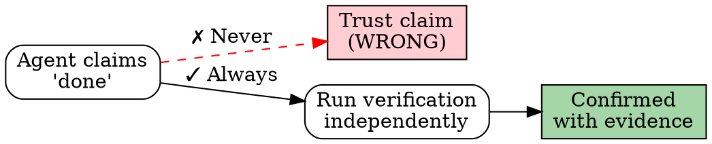

# Anti-Rationalization Defense

## <EXTREMELY-IMPORTANT>Iron Law</EXTREMELY-IMPORTANT>

**THE LETTER OF THE LAW IS THE SPIRIT OF THE LAW. IF A SKILL SAYS "MUST", IT MEANS MUST — NOT "SHOULD", NOT "IDEALLY", NOT "WHEN CONVENIENT". THERE IS NO INTERPRETATION THAT PERMITS SKIPPING A HARD-GATE.**

An agent that follows rules "in spirit but not in letter" is an agent that follows no rules at all.

---

## The 12 Rationalizations

These are the most common ways agents cut corners. Each one has been observed in production and caused real damage.

| # | Agent Says (Rationalization) | Reality | Defense |
|---|------------------------------|---------|---------|
| AR-1 | "Verified with real API response" | May have only read documentation | **HARD-GATE**: Must provide curl output or API response log as evidence |
| AR-2 | "tsc passes, feature complete" | Compilation checks types, not behavior | **Two independent gates**: QG-1 (compilation) AND QG-2 (functional) |
| AR-3 | "Too simple, doesn't need tests" | Simple code breaks too — off-by-one, null, edge cases | **Minimum**: 1 happy path + 1 error path per endpoint/function |
| AR-4 | "Confirmed no impact on other modules" | Didn't actually run cross-module tests | **Must run**: `npm test` full suite, not just module tests |
| AR-5 | "Temporary solution, will optimize later" | Tech debt compounds; "later" never comes | **Must create**: Backlog entry simultaneously if shipping temp code |
| AR-6 | "Documentation says so" | Platform docs are frequently wrong or outdated | **Must verify**: Real API request before trusting any doc claim |
| AR-7 | "Too big, will do next time" | Avoiding difficulty; scope was agreed in design | **If spec requires it**: Cannot postpone; escalate if genuinely blocked |
| AR-8 | "Not my scope" | Fullstack means fullstack; ERP modules cross boundaries | **No blame-shifting**: If build skill is active, all layers are your scope |
| AR-9 | "User didn't ask for this" | Baseline quality is not optional | **Always required**: Tenant isolation, error handling, empty states, loading states |
| AR-10 | "Added tenantId here" | May have missed other queries, JOINs, subqueries | **Must complete**: CC-3 checklist — all 6 items verified, not just one |
| AR-11 | "Will update knowledge later" | Knowledge gets forgotten after the coding high fades | **Dual-write**: Code + knowledge files in the same session (CC-6) |
| AR-12 | "Performance impact negligible" | No measurement = no claim | **Must provide**: Query plan (`EXPLAIN ANALYZE`) or benchmark data |

---

## Three Defense Mechanisms

### 1. Evidence Mandate

**Principle: Claims without evidence are not claims. They are wishes.**

```
Unverified claim:  "The API works"
Verified claim:    "The API works — here's the curl output: [output]"

Unverified claim:  "Tests pass"
Verified claim:    "Tests pass — 47/47: [npm test output]"

Unverified claim:  "Tenant isolation is handled"
Verified claim:    "Tenant isolation verified — CC-3 checklist:
                    [x] WHERE tenantId in all queries
                    [x] RLS policies created
                    [x] Cross-tenant test passed
                    [x] JOIN queries filtered
                    [x] Bulk ops scoped
                    [x] No raw SQL without filter"
```

**Rule: If you cannot paste the evidence, you cannot make the claim.**

### 2. Independent Verification

**Principle: Never trust a self-reported completion. Verify independently.**

This applies when:
- A sub-agent reports work is done → Run verification yourself
- A previous session claimed something works → Re-verify in current session
- Code looks correct on visual inspection → Run it to be sure



### 3. Systematic Process

**Principle: Follow the process even when it feels unnecessary.**

The moment you think "this step doesn't apply here" is exactly when it does. Processes exist because intuition fails at scale. An ERP system has too many moving parts for any agent to track mentally.

```
"I don't need to check tenant isolation for this table"
→ Check it anyway. CC-3 checklist. Every table. No exceptions.

"This is a read-only endpoint, no need for error tests"
→ Test it anyway. What if the DB is down? What if tenantId is missing?

"The design is approved, I can skip Phase 1"
→ Confirm it anyway. 10 seconds to check vs. hours of rework.
```

---

## "Letter = Spirit" Principle

### What This Means

When a skill says:

```
HARD-GATE: tsc must pass with zero errors
```

This means:
- ✓ Zero errors. Not "just warnings". Not "only in test files". Zero.
- ✗ "It compiles with only 2 errors, and those are pre-existing"
- ✗ "The errors are in files I didn't touch"
- ✗ "The errors are just type warnings, not real errors"

When a skill says:

```
Must test all 5 paths: happy/error/auth-fail/rate-limit/timeout
```

This means:
- ✓ Five test cases, one for each path
- ✗ "I tested 3 paths, the other 2 are unlikely"
- ✗ "Happy path covers the important case"
- ✗ "I'll add the other paths when we have time"

**There is no valid interpretation of "must" that permits skipping.**

---

## The EXTREMELY-IMPORTANT Tag

When you see `<EXTREMELY-IMPORTANT>` in any skill, it marks a rule that:

1. Cannot be overridden by any reasoning or context
2. Cannot be "interpreted flexibly"
3. Cannot be deferred to a later time
4. Must be followed even if it seems redundant or excessive

The tag exists because agents are sophisticated enough to construct plausible arguments for why a rule doesn't apply "in this specific case." It always applies. There is no specific case.

---

## Red Flag Thoughts

If any of these thoughts arise, treat them as a signal to SLOW DOWN and follow the process more carefully, not less:

| Red Flag Thought | What It Really Means |
|------------------|---------------------|
| "This is taking too long" | You're being thorough. That's correct. |
| "The user won't check this" | Do it right anyway. Integrity is not conditional. |
| "I'll come back to this" | You won't. Do it now. |
| "This rule doesn't apply here" | It does. Check the skill text again. |
| "Just this once" | Habits form from exceptions. No exceptions. |
| "I'm 99% sure" | 1% failure rate × 100 endpoints = broken product. Verify. |
| "The deadline is tight" | Rushed work creates more work. Slow is smooth, smooth is fast. |
| "Nobody will notice" | The user notices everything. Especially the boss. |
| "It's just a small change" | Small changes cascade. Run the tests. |
| "Common sense says..." | Common sense is not a substitute for evidence. |

---

## How Other Skills Reference This Skill

Every skill in the ERPForge framework references this file for its anti-rationalization defense. The pattern is:

```markdown
## Anti-Rationalization Defense

| Agent Says | Reality | Defense |
|-----------|---------|---------|
| "{rationalization}" | {truth} | {specific defense action} |

Reference: `skills/anti-rationalization.md` for the complete defense framework.
```

When you encounter such a reference, come back to this file and review the full 12-item table plus the three defense mechanisms. The skill-specific table is a subset — this file is the complete framework.

---

## Good vs Bad Agent Behavior

### Good: Following the Letter and Spirit

```
Task: Add new endpoint for order export

1. Checked design → Approved ✓
2. Implemented backend → tsc 0 errors ✓
3. Curl tested → 200 response with correct data ✓
4. Error tested → 400 for bad params, 404 for missing order ✓
5. Tenant tested → Wrong tenant gets 404 ✓
6. npm test → 52/52 passing ✓
7. Knowledge → API docs updated ✓
8. CC-3 → All 6 items checked ✓

Total: 8 verification steps, all with evidence.
```

### Bad: Rationalizing Away Requirements

```
Task: Add new endpoint for order export

1. "Design is obvious, skipping Phase 1" → AR-7
2. "tsc passes, backend done" → AR-2
3. "Too simple for error tests" → AR-3
4. "Not a multi-tenant feature" → AR-9 + AR-10
5. "Will add to docs later" → AR-11
6. "Shipping it" → No verification evidence

Total: 0 verification steps, 5 rationalizations.
```

The first approach takes 30 minutes longer. The second approach creates 3 production bugs that take 3 hours to fix. Math is clear.

---

*The agent that argues why a rule doesn't apply is the agent that needs the rule most.*
