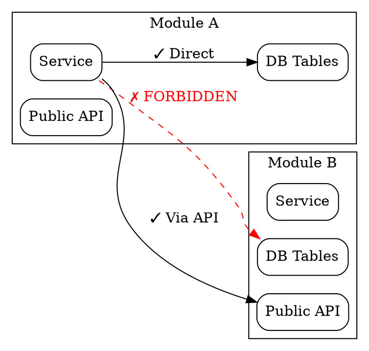
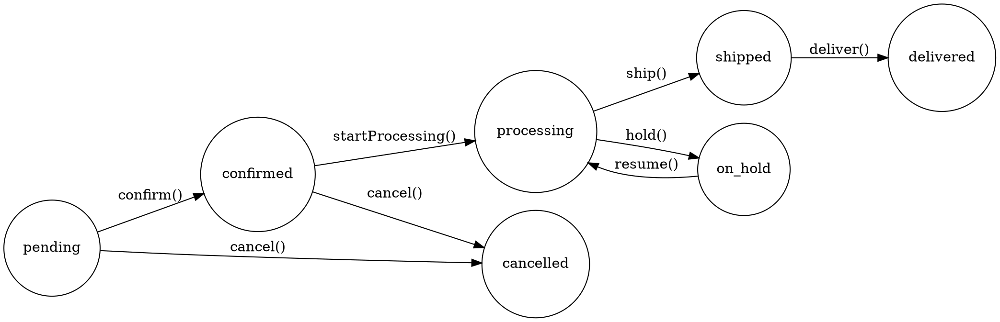

# ERP Module Design

## <EXTREMELY-IMPORTANT>Iron Law</EXTREMELY-IMPORTANT>

**NO CODE SHALL BE WRITTEN UNTIL THE DESIGN IS APPROVED BY THE USER.**

Design is a conversation, not a monologue. Every data model, state machine, and API contract must be explicitly approved before a single line of production code is written. "I think this is right" is not approval.

---

## Phase 1: Socratic Requirements Elicitation

Before designing anything, understand what you're designing. Use Socratic questioning to refine requirements — **ask one question at a time**, and prefer multiple-choice questions over open-ended ones.

### Questioning Protocol

```
1. Start with the business problem, not the technical solution
2. Ask ONE question per message — never stack questions
3. Prefer multiple-choice: "Which best describes your need? (A) ... (B) ... (C) ..."
4. Each answer narrows scope; each question builds on the previous answer
5. Continue until you can write a one-paragraph module summary the user agrees with
```

### Good vs Bad Questioning

**Good:**
> "This module needs to track inventory. Which model fits your business?
> (A) Single-warehouse — all stock in one location
> (B) Multi-warehouse — stock distributed across locations
> (C) Virtual warehouse — logical separation within one physical location"

**Bad:**
> "Tell me everything about how you want inventory to work, including warehouses, locations, zones, bin management, cycle counting, and reorder points."

The good example is answerable in one word. The bad example requires a whitepaper.

---

## Phase 2: Module Boundary Definition

### HARD-GATE: Module Boundary Check

Before proceeding to data model design, verify:

- [ ] Module has a clear, single responsibility (one sentence description)
- [ ] Module communicates with other modules ONLY through Public API
- [ ] No direct cross-module database queries
- [ ] Module owns its own tables — no shared tables between modules
- [ ] Dependencies are explicitly listed (which modules does this one call?)

### Module Boundary Rules



**Rules:**
1. Each module exposes a Public API (REST endpoints or service interface)
2. Cross-module communication goes through the Public API only
3. No module reads or writes another module's database tables
4. Shared concepts (e.g., `tenantId`, `userId`) are passed as parameters, not imported

---

## Phase 3: Data Model Design

### Design Checklist

For every table in the module, verify:

| # | Check | Required |
|---|-------|----------|
| 1 | Table name follows `snake_case` convention | Always |
| 2 | Primary key is `id` (UUID or serial) | Always |
| 3 | `tenantId` column exists with foreign key | Always |
| 4 | `createdAt` / `updatedAt` timestamps exist | Always |
| 5 | `createdBy` / `updatedBy` user references exist | Always |
| 6 | Indexes defined for query patterns | Always |
| 7 | Foreign keys have `ON DELETE` behavior defined | When FK exists |
| 8 | Enum columns use PostgreSQL enum types | When enums exist |
| 9 | Decimal columns use `numeric(precision, scale)` | When money/quantity |
| 10 | JSON columns have documented schema | When JSONB used |

### Multi-Tenant Design (Reference: `protocols/cross-cutting-checks.md` CC-3)

Every table MUST include:

```sql
tenantId UUID NOT NULL REFERENCES tenants(id),
-- + RLS policy:
CREATE POLICY tenant_isolation ON table_name
    USING (tenant_id = current_setting('app.current_tenant')::uuid);
```

### Relationship Patterns

Document every relationship explicitly:

```
orders (1) --- (*) order_items     -- One order has many items
products (1) --- (*) skus          -- One SPU has many SKUs
skus (*) --- (*) warehouses        -- Many-to-many via inventory table
```

---

## Phase 4: State Machine Design

For any entity with a lifecycle (orders, listings, shipments, payments), define a formal state machine.

### State Machine Framework

Use `dot` syntax to define the state machine:



### State Machine Checklist

- [ ] All states enumerated (including terminal states)
- [ ] All transitions enumerated with trigger actions
- [ ] Invalid transitions explicitly listed (what CANNOT happen)
- [ ] Side effects for each transition documented (emails, webhooks, journal entries)
- [ ] Concurrent transition handling defined (what if two users act simultaneously?)

---

## Phase 5: API Contract Design

### Endpoint Design Template

For each endpoint, document:

```yaml
POST /api/v1/{module}/{resource}
  Auth: Bearer token (tenant-scoped)
  Request Body:
    field1: string (required) — description
    field2: number (optional, default: 0) — description
  Response 200:
    { id, field1, field2, createdAt }
  Response 400:
    { error: "VALIDATION_ERROR", details: [...] }
  Response 404:
    { error: "NOT_FOUND" }
```

### API Design Rules

1. RESTful resource naming (`/orders`, not `/getOrders`)
2. Consistent error response format across all endpoints
3. Pagination for all list endpoints (`?page=1&pageSize=20`)
4. Filter/sort parameters follow consistent naming
5. Tenant isolation enforced at middleware level (not per-endpoint)

---

## Phase 6: Design Output Format

### Required Design Document Structure

When presenting the design to the user for approval, use this structure:

```markdown
## Module: {Name}

### Summary
One paragraph describing what this module does and why.

### Module Dependencies
- Depends on: [list of modules this one calls]
- Depended by: [list of modules that call this one]

### Data Model
[Table definitions with all columns, types, constraints]

### State Machine
[Graphviz diagram + transition table]

### API Endpoints
[Endpoint definitions with request/response schemas]

### Open Questions
[Anything that needs user input before implementation]
```

---

## Anti-Rationalization Defense

| Agent Says | Reality | Defense |
|-----------|---------|---------|
| "The design is obvious, let me just code it" | No design survives first contact with requirements | HARD-GATE: Design document required |
| "I'll figure out the data model as I code" | Schema changes after data exists are painful | Design all tables before writing any code |
| "This is just a simple CRUD module" | ERP modules are never simple — tenant isolation, audit trails, state machines | Run the full checklist regardless |
| "The user will probably want X" | Assumptions create rework | Ask, don't assume |

Reference: `skills/anti-rationalization.md` for the complete defense framework.

---

## Red Flag Checklist

Stop and reassess if you catch yourself thinking:

- [ ] "I already know what they want" — You don't. Ask.
- [ ] "This table doesn't need tenantId" — It does. Always.
- [ ] "I'll add the state machine later" — No. Design it now.
- [ ] "The existing module does it this way, so I'll copy it" — Existing code may be wrong.
- [ ] "One more question will annoy the user" — One missed requirement will annoy them more.
- [ ] "This is too detailed for the design phase" — The detail you skip now becomes the bug you chase later.

---

## Good vs Bad Module Design

### Good: Order Module Design

```
Module: Order Management
Responsibility: Track orders from creation through fulfillment to completion
Boundary: Owns order_*, communicates with Inventory via API, Accounting via events
Tables: orders, order_items, order_status_history, order_notes
State Machine: 10 states, 15 transitions, all documented
API: 12 endpoints, all with request/response schemas
Tenant Isolation: tenantId on all tables + RLS policies
```

### Bad: "Order Stuff"

```
Module: Orders
Tables: orders (has everything in one table)
API: POST /createOrder, GET /getOrders
State Machine: "we'll figure it out"
Tenant Isolation: "we'll add it later"
```

The good example is implementable. The bad example is a recipe for 3 rewrites.

---

## Knowledge Resources

Before designing, check if relevant domain knowledge exists:

- `knowledge/domain/` — Business domain models and rules
- `knowledge/architecture/` — System architecture decisions and patterns
- `knowledge/platforms/` — Platform-specific constraints that affect design

These files encode decisions that have already been made. Read them before proposing something that contradicts established patterns.

---

*Design is the cheapest phase to make changes. Code is the most expensive. Invest time here.*
