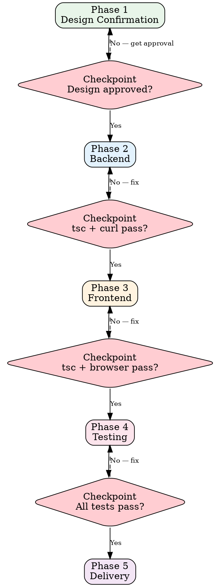
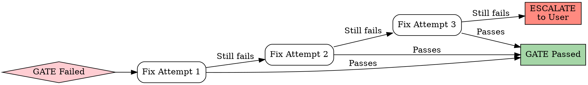

# Fullstack Module Build

## Key Principle

**tsc passing does not mean the feature works.** Every phase must be verified with real evidence — curl output, browser screenshots, test results.

Compilation proves syntax. Only real requests prove functionality.

## Why This Matters for ERP

In ERP, a "working" module that lacks tenant isolation or proper error states will fail in production. The phase gates catch these issues before they reach real users. When an order module compiles but allows cross-tenant data access, you don't have a bug — you have a security incident.

---

## Build Pipeline Overview



---

## Phase 1: Design Confirmation

### Checkpoint: Design Approval

Before writing ANY implementation code:

- [ ] Design document exists (from `skills/erp-module-design.md`)
- [ ] User has explicitly approved the design
- [ ] Data model, state machine, and API contracts are finalized
- [ ] No open questions remain

**If any item is unchecked, go back to design phase.**

---

## Phase 2: Backend

### Build Order

```
Schema (Drizzle) → Routes (Express) → Service Layer → Verification
```

### 2.1 Schema (Drizzle ORM)

- Define tables in `server/src/db/schema/{module}.ts`
- Every table includes: `id`, `tenantId`, `createdAt`, `updatedAt`, `createdBy`, `updatedBy`
- Generate and review migration: `npm run db:generate`
- Apply migration: `npm run db:migrate`
- Reference: `templates/backend-module.md` for schema scaffolding

### 2.2 Routes (Express)

- Define routes in `server/src/routes/{module}.ts`
- Register routes in the main router
- Use middleware for: auth, tenant isolation, request validation
- Follow RESTful conventions from the design document

### 2.3 Service Layer

- Business logic in `server/src/services/{module}.ts`
- Services receive `tenantId` as parameter — never extract from request directly
- All database queries include `tenantId` in WHERE clause
- Cross-module calls go through other modules' service interfaces, not direct DB

### 2.4 Backend Verification

**Checkpoint: All must pass before proceeding to frontend.**

| Check | Command | Evidence Required |
|-------|---------|-------------------|
| TypeScript compiles | `npx tsc --noEmit` | Terminal output: 0 errors |
| No `as any` or `@ts-ignore` | grep codebase | Zero matches in new code |
| API responds correctly | `curl` each endpoint | Full request + response body |
| Error cases handled | `curl` with bad input | Proper error responses |
| Tenant isolation works | Query with wrong tenant | Empty result or 403 |

### Tenant Isolation Check (Reference: `protocols/cross-cutting-checks.md` CC-3)

- [ ] Every query includes `WHERE tenantId = ?`
- [ ] RLS policy created for new tables
- [ ] Tested: Tenant A cannot see Tenant B's data
- [ ] JOIN queries filter on tenantId for all joined tables
- [ ] Bulk operations scope to single tenant
- [ ] No raw SQL without tenantId

---

## Phase 3: Frontend

### Build Order

```
Page Component → Sub-Components → API Layer → Verification
```

### 3.1 Page Component

- Create page in `client/src/pages/{module}/`
- Register route in the router
- Use layout patterns from `templates/list-page.md` or `templates/detail-page.md`

### 3.2 Sub-Components

- Module-specific components in `client/src/pages/{module}/components/`
- Shared components from the existing component library
- Follow established UI patterns (filter bar, data table, detail panel)

### 3.3 API Layer

- API hooks in `client/src/api/{module}.ts`
- Use the project's established data fetching pattern (React Query or equivalent)
- Error handling with user-facing messages
- Loading and empty states

### 3.4 Frontend Verification

**Checkpoint: All must pass before proceeding to testing.**

| Check | Method | Evidence Required |
|-------|--------|-------------------|
| TypeScript compiles | `npx tsc --noEmit` | Terminal output: 0 errors |
| Page renders | Open in browser | Screenshot or console log |
| Data loads | Interact with page | Network tab shows successful API calls |
| Error states work | Trigger errors | Error UI displays correctly |
| Empty state works | Empty dataset | Empty state UI displays |
| Responsive layout | Resize browser | No overflow or broken layout |

---

## Phase 4: Testing

### Test Pyramid for ERP Modules

```
        /  E2E  \          — Critical paths only
       /----------\
      / Integration \      — API endpoints + DB
     /----------------\
    /    Unit Tests     \  — Business logic + utils
   /----------------------\
```

### Required Test Coverage

| Test Type | What to Test | Minimum |
|-----------|-------------|---------|
| Unit | Service functions, utils, validators | 1 happy + 1 error per function |
| Integration | Each API endpoint | 1 happy + 1 error per endpoint |
| Multi-tenant | Tenant isolation | 1 cross-tenant test per table |
| State machine | Valid + invalid transitions | All transitions |

### Multi-Tenant Isolation Tests (Reference: `protocols/cross-cutting-checks.md` CC-3)

Every module MUST include tests that verify:

```typescript
// Tenant A creates data
const itemA = await createItem({ tenantId: tenantA.id, ... });

// Tenant B cannot see it
const listB = await listItems({ tenantId: tenantB.id });
expect(listB).not.toContainEqual(expect.objectContaining({ id: itemA.id }));

// Tenant B cannot update it
await expect(updateItem({ tenantId: tenantB.id, id: itemA.id, ... }))
  .rejects.toThrow(); // or returns 404
```

### Test Execution

```bash
# Run all tests
npm test

# Run module-specific tests
npm test -- --grep "{module}"
```

**Checkpoint: All tests must pass. Zero failures. Zero skipped tests in new code.**

---

## Phase 5: Delivery

### 5.1 Knowledge Dual-Write (Reference: `protocols/cross-cutting-checks.md` CC-6)

Every module delivery MUST update knowledge files:

| Change Type | Knowledge File to Update |
|-------------|------------------------|
| New module | `knowledge/architecture/` — module overview |
| New API endpoints | API documentation |
| New state machine | `knowledge/domain/` — lifecycle documentation |
| Platform-specific behavior | `knowledge/platforms/` — quirks and mappings |
| Design decisions | Architecture Decision Records |

### 5.2 Delivery Checklist

- [ ] All Phase 2-4 Checkpoints passed with evidence
- [ ] Code reviewed for `as any`, `@ts-ignore`, empty catch blocks
- [ ] Database migration is reversible
- [ ] Knowledge files updated (dual-write)
- [ ] No console.log or debug code left in production code
- [ ] Git commit with descriptive message

---

## Dev-QA Loop

When a Checkpoint fails:



**Rule: Maximum 3 fix attempts per gate. After 3 failures → escalate to user with:**
1. What was attempted
2. What failed and why
3. Proposed alternative approaches

---

## ERP Delivery Risks

| Risk | What Goes Wrong | Prevention |
|------|----------------|------------|
| "tsc passes, backend is done" | Compilation ≠ functionality | Must curl every endpoint |
| "Frontend compiles, page works" | Must verify in browser | Screenshot or console evidence |
| "Too simple to need tests" | Simple code breaks too | Every endpoint: 1 happy + 1 error |
| "Added tenantId to the query" | May have missed other queries | CC-3 checklist all 6 items |
| "Will add tests later" | Later never comes | Tests in Phase 4, not Phase 6 |
| "Not my scope" | Fullstack means fullstack | All layers are your scope |

Reference: `skills/anti-rationalization.md` for the complete risk catalog.

---

## Red Flag Checklist

Stop and reassess if you catch yourself:

- [ ] Skipping Phase 1 because "the design is obvious"
- [ ] Writing frontend before backend verification passes
- [ ] Writing tests that only test the happy path
- [ ] Using `as any` to "fix" a type error
- [ ] Moving to Phase 5 with any Checkpoint unchecked
- [ ] Saying "it works" without curl output or screenshot evidence
- [ ] Testing with only one tenant's data

---

*Build systematically. Verify relentlessly. Deliver with evidence.*
