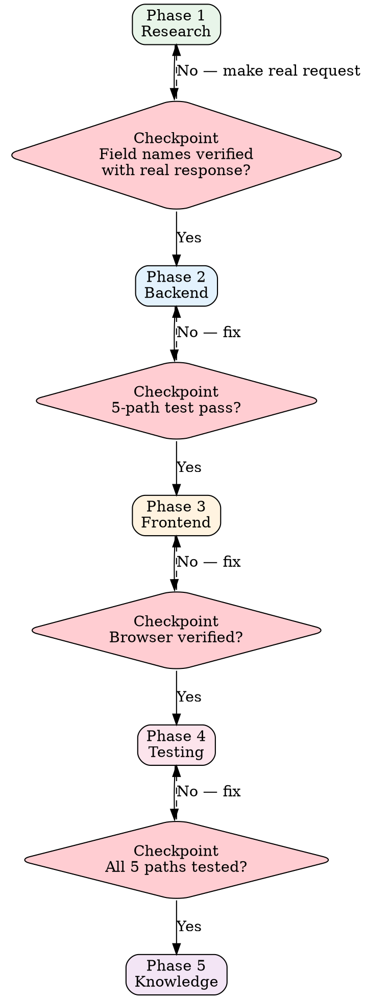

# Platform Integration

## Key Principle

**Platform API documentation is unreliable.** Never write field mapping code based on documentation alone — verify every field name with a real API response first.

Docs say `itemId`. Reality returns `item_id`. One wrong field name = silent data loss in production.

## Why This Matters for ERP

Platform APIs are the most unreliable part of any ERP. Field names in docs don't match reality, sandbox behavior differs from production, and rate limits vary by time of day. The verification steps here prevent the #1 cause of ERP production incidents.

---

## Integration Pipeline



---

## Phase 1: Research

### 1.1 Read Existing Knowledge

Before touching any code, read:

1. `knowledge/platforms/platform-abstraction.md` — Unified abstraction pattern
2. `knowledge/platforms/platform-{name}.md` — Platform-specific quirks and mappings
3. Existing platform implementations — Learn the established patterns

### 1.2 API Documentation Review

For each API endpoint you need to integrate:

| Item | Document |
|------|----------|
| Auth flow type | OAuth2 Authorization Code / Client Credentials / API Key |
| Base URL | Production + Sandbox endpoints |
| Rate limits | Requests per second/minute, burst limits |
| Pagination pattern | Cursor / Offset / Token-based |
| Webhook support | Available events, payload format |
| Field naming convention | camelCase / snake_case / PascalCase |

### 1.3 Field Mapping Verification

**Checkpoint: Every field name must be verified with a real API response.**

```bash
# GOOD: Verify field names with real request
curl -H "Authorization: Bearer $TOKEN" \
  "https://api.platform.com/v1/orders?limit=1" | jq '.'
# Then map based on ACTUAL response fields

# BAD: Read docs, assume field names, write mapping code
# Docs say: { "orderId": "..." }
# Reality:  { "order_id": "..." }
```

Create a field mapping table:

| Our Field | Platform Field | Verified? | Notes |
|-----------|---------------|-----------|-------|
| orderId | order_id | ✓ curl output | Docs say "orderId" — WRONG |
| status | orderStatus | ✓ curl output | Enum values differ from docs |
| total | totalAmount.value | ✓ curl output | Nested object, not flat |

---

## Phase 2: Backend

### 2.1 OAuth Client

Implement the platform's authentication flow:

```
Authorization Code Flow:
  User → Redirect to Platform → Auth Code → Exchange for Token → Store Token → Refresh Loop

Client Credentials Flow:
  App Credentials → Request Token → Store Token → Refresh Loop
```

**Key requirements:**
- Token storage: encrypted at rest, scoped to tenant
- Token refresh: automatic, before expiry (not after failure)
- Multi-tenant: each tenant has their own platform credentials
- Error handling: distinguish auth errors from API errors

### 2.2 API Client

Build on the PlatformEngine base class:

```typescript
// Reference: knowledge/platforms/platform-abstraction.md
abstract class PlatformEngine {
  abstract getOrders(params: GetOrdersParams): Promise<PlatformOrder[]>;
  abstract getProduct(id: string): Promise<PlatformProduct>;
  abstract updateInventory(updates: InventoryUpdate[]): Promise<void>;
  // ... shared interface
}

class EbayEngine extends PlatformEngine {
  // Platform-specific implementation
}
```

**Rules:**
- No platform-specific types leak outside the engine
- All responses are mapped to internal types before returning
- Rate limiting handled inside the client (not by callers)
- Retry logic with exponential backoff for transient errors

### 2.3 Field Mapper

Map between platform-specific and internal data models:

```typescript
// Mapper transforms platform response to internal type
function mapPlatformOrder(raw: EbayRawOrder): InternalOrder {
  return {
    externalId: raw.order_id,        // NOT raw.orderId (docs lie)
    status: mapOrderStatus(raw.orderStatus),
    total: parseDecimal(raw.totalAmount.value),
    currency: raw.totalAmount.currency,
    // ...
  };
}
```

### 2.4 Sync Worker

Background job that synchronizes data between platform and internal system:

- Pull strategy: periodic polling with cursor/timestamp
- Push strategy: webhook receiver (when platform supports it)
- Idempotency: same event processed twice must produce same result
- Conflict resolution: platform is source of truth for platform-originated data

### Error Code Mapping

**Critical: Map platform HTTP errors to appropriate internal errors.**

| Platform Returns | Internal Response | Reason |
|-----------------|-------------------|--------|
| 401 Unauthorized | 502 Bad Gateway | Prevent frontend from triggering JWT refresh |
| 403 Forbidden | 502 Bad Gateway | Same — upstream auth issue, not our auth |
| 429 Rate Limited | 503 Service Unavailable | Retry-After header preserved |
| 500+ Server Error | 502 Bad Gateway | Platform is down, not us |
| 404 Not Found | 404 Not Found | Pass through — item genuinely missing |

**Why 502 for upstream 401?** If we return 401, the frontend's auth interceptor will try to refresh our JWT token — which is not the problem. The problem is the platform token, which requires a different fix (re-auth with platform).

---

## Phase 3: Frontend

### 3.1 Platform Configuration Page

- OAuth connection flow (connect/disconnect)
- Credential management
- Sync settings (frequency, scope)
- Connection health status

### 3.2 Data Display Pages

- Platform-synced data with source indicators
- Sync status and last-sync timestamps
- Manual sync trigger
- Error log for failed syncs

---

## Phase 4: Testing

### 5-Path Testing Pattern

Every platform API interaction must be tested with these 5 scenarios:

| # | Path | Test | Expected |
|---|------|------|----------|
| 1 | Happy | Valid request, valid response | Data mapped correctly |
| 2 | Error | Valid request, error response (400/404) | Proper error handling |
| 3 | Auth Fail | Expired/invalid token (401/403) | Token refresh triggered |
| 4 | Rate Limit | 429 response | Retry with backoff |
| 5 | Timeout | No response / timeout | Graceful failure, retry |

### Mock Strategy

```typescript
// Mock the HTTP layer, not the business logic
const mockAxios = new MockAdapter(axios);

// Path 1: Happy path
mockAxios.onGet('/orders').reply(200, realApiResponseFixture);

// Path 2: Error response
mockAxios.onGet('/orders').reply(400, { error: 'INVALID_PARAM' });

// Path 3: Auth failure
mockAxios.onGet('/orders').reply(401, { error: 'TOKEN_EXPIRED' });

// Path 4: Rate limit
mockAxios.onGet('/orders').reply(429, null, { 'Retry-After': '5' });

// Path 5: Timeout
mockAxios.onGet('/orders').timeout();
```

**Use real API response fixtures**: Capture actual API responses during research phase and use them as test fixtures. This ensures your mocks match reality.

---

## Phase 5: Knowledge

### Knowledge Dual-Write (Reference: `protocols/cross-cutting-checks.md` CC-6)

After completing integration, update:

| File | What to Add |
|------|-------------|
| `knowledge/platforms/platform-{name}.md` | Quirks discovered during integration |
| `knowledge/platforms/platform-abstraction.md` | Any changes to the abstraction pattern |
| Field mapping table | Verified field names + gotchas |
| Error code map | Platform-specific error behaviors |

### Quirks Documentation Template

```markdown
## Quirk: {Platform} {Description}

**Discovered**: {date}
**Impact**: {what breaks if you don't know this}
**Workaround**: {what we do instead}
**Verified**: {how we know this — curl output, support ticket, etc.}
```

---

## ERP Delivery Risks

| Risk | What Goes Wrong | Prevention |
|------|----------------|------------|
| Field mapping from docs only | Docs say `itemId`, API returns `item_id` — silent data loss | Must provide curl output with verified field names |
| Only testing happy path | 4 other paths WILL happen in production | All 5 paths tested |
| Rate limiting ignored | Sync operations hit rate limits during peak hours | Test path 4 explicitly with backoff |
| Wrong error code mapping | Upstream 401 passed as 401 triggers frontend auth loop | Map upstream auth errors to 502 |
| Platform quirks undocumented | Next developer hits the same bug 3 months later | Add to `knowledge/platforms/` immediately |

Reference: `skills/anti-rationalization.md` for the complete risk catalog.

---

## Red Flag Checklist

Stop and reassess if you catch yourself:

- [ ] Writing field mapping code without a real API response in hand
- [ ] Assuming platform docs are accurate without verification
- [ ] Testing only the happy path
- [ ] Returning platform 401 as internal 401
- [ ] Skipping token refresh logic ("we'll add it later")
- [ ] Hardcoding platform-specific logic outside the engine class
- [ ] Not documenting a quirk you discovered

---

## Good vs Bad Integration

### Good

```
1. Read platform docs for overview
2. Made real API request, discovered 3 field name discrepancies
3. Built mapper using VERIFIED field names
4. Tested all 5 paths
5. Documented 2 new quirks in knowledge file
6. Error codes properly mapped (upstream 401 → 502)
```

### Bad

```
1. Read platform docs
2. Wrote mapper based on docs
3. Tested happy path
4. "Ship it"
→ Production: silent data loss because docs said "itemId" but API returns "item_id"
→ Production: frontend logout loop because upstream 401 passed through as 401
```

---

*Trust the response, not the documentation. Verify everything.*
