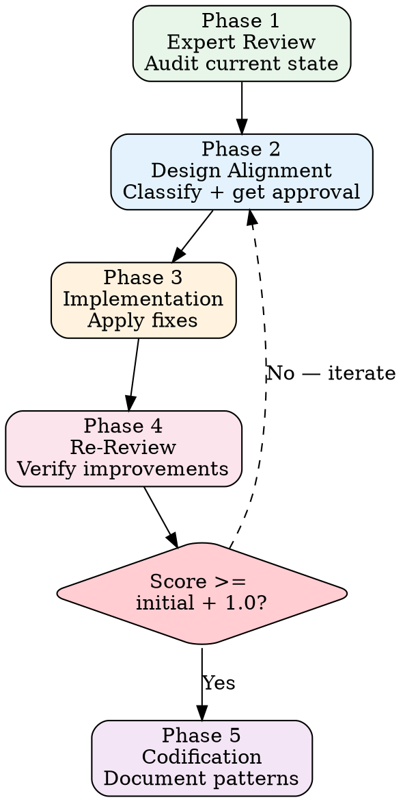

# Quality Polish

## <EXTREMELY-IMPORTANT>Iron Law</EXTREMELY-IMPORTANT>

**"NOT PERFECT ENOUGH" IS A VALID REASON TO REJECT WORK. EVERY PIXEL, EVERY ANIMATION FRAME, EVERY NUMBER FORMAT MATTERS. THIS IS AN ENTERPRISE SAAS PRODUCT, NOT A PROTOTYPE.**

Details are not optional. Details are the product.

---

## Polish Pipeline



---

## Phase 1: Expert Review

Audit the current state of the module with a critical eye. Score each dimension:

### Review Dimensions

| Dimension | Weight | What to Look For |
|-----------|--------|-----------------|
| Layout & Spacing | 20% | Consistent gaps, alignment, breathing room |
| Typography | 15% | Font sizes, weights, hierarchy, truncation |
| Color & Contrast | 15% | Palette consistency, accessibility, semantic use |
| Animation & Motion | 20% | Timing, easing, choreography, entrance/exit |
| Data Display | 15% | Number formatting, empty states, loading states |
| Interaction | 15% | Hover, focus, click feedback, error states |

### Scoring Scale

```
1-2: Broken — Visually broken or functionally impaired
3-4: Draft — Works but feels like a prototype
5-6: Acceptable — Functional, no obvious issues
7-8: Good — Polished, consistent, professional
9-10: Excellent — Delightful, enterprise-grade, "boss dopamine"
```

**Target: Every dimension at 8+. Overall score improvement >= 1.0 per polish cycle.**

---

## Phase 2: Design Alignment

### Three-Level Decision Framework

| Level | Scope | Action | Example |
|-------|-------|--------|---------|
| L1 — Cosmetic | Color, spacing, border-radius, font-size | Execute autonomously, show screenshots after | Change gap-3 to gap-2 |
| L2 — Layout | Component structure, interaction pattern, data layout | Present options, get approval, then execute | Redesign filter bar layout |
| L3 — System | Design tokens, brand expression, new component patterns | Discuss with user + document decision | New animation system |

### HARD-GATE: Level Classification

Before implementing ANY polish change:

1. Classify the change as L1, L2, or L3
2. If L2 or L3: present the change and get approval before writing code
3. If unsure: default to the higher level

**Why this matters:** Polish is subjective. What you think looks better might not match the user's vision. The cost of asking is 30 seconds. The cost of rework is 30 minutes.

---

## Phase 3: Implementation

### ERP Design Principles (Core Beliefs)

#### "The Dashboard Is the Boss's Dopamine"

The dashboard is the first thing the business owner sees every morning. It must:
- Deliver key metrics instantly (no loading spinners on critical numbers)
- Use color to communicate meaning (green = good, red = attention)
- Feel alive — subtle animations that reward engagement
- Present data with appropriate precision (integers stay integers)

#### Animation Choreography

All animations in a view must be **choreographed as a unified sequence**, not assembled from independent pieces.

**Rules:**
1. **Same easing** — All elements in a view use the same easing function
2. **Same duration** — Base duration is consistent (e.g., 200ms)
3. **Same frame end** — All animations complete on the same frame
4. **Stagger, don't stack** — Elements enter in sequence with consistent stagger delay
5. **Spring overshoot** — Subtle spring physics for interactive elements (micro-bounce)

```css
/* Good: Unified choreography */
.card-enter {
    animation: slideUp 200ms cubic-bezier(0.34, 1.56, 0.64, 1) both;
}
.card-enter:nth-child(1) { animation-delay: 0ms; }
.card-enter:nth-child(2) { animation-delay: 40ms; }
.card-enter:nth-child(3) { animation-delay: 80ms; }
/* All finish within 280ms, same easing, consistent stagger */

/* Bad: Mismatched animations */
.card-a { animation: fadeIn 300ms ease-in; }
.card-b { animation: slideUp 200ms ease-out; }
.card-c { animation: scale 400ms linear; }
/* Different durations, different easings, no choreography */
```

#### Integer Stays Integer

During animations, intermediate values for integers must remain integers:

```
✓ Counter: 0 → 1 → 2 → 3 → ... → 47
✗ Counter: 0 → 0.3 → 1.7 → 3.2 → ... → 47.0
```

Use `Math.round()` for animated number displays. Display "47", not "47.0".

#### No Skeleton Flash

When switching between data views (tab change, filter change):

```
✓ Keep old data visible + reduce opacity → Load new data → Crossfade
✗ Show skeleton/spinner → Load new data → Render
```

The skeleton flash creates a jarring experience. Maintain visual continuity by keeping stale data visible at reduced opacity while fresh data loads.

### Apple HIG Principles Applied to ERP

| Principle | Application |
|-----------|-------------|
| **Clarity** | Data hierarchy is immediately obvious. Primary metrics are prominent. |
| **Deference** | UI chrome recedes. Content (data) is the hero. |
| **Depth** | Layers create visual hierarchy. Modals float above content. |
| **Consistency** | Same action looks the same everywhere. No surprises. |

---

## Phase 4: Re-Review

After implementing polish changes, re-score every dimension:

### HARD-GATE: Score Improvement

```
Re-review score >= Initial score + 1.0
```

If the improvement is less than 1.0:
1. Identify which dimensions didn't improve
2. Return to Phase 2 with targeted fixes
3. Re-review again

### Evidence Requirements

For each polish change, provide:
- Before state (description or reference)
- After state (browser verification)
- Which dimension improved and by how much

---

## Phase 5: Codification

### Document Patterns

When polish work establishes a new pattern:

1. **If it's a reusable pattern** → Document in the component library or design system
2. **If it's a one-off fix** → No documentation needed
3. **If it changes an existing convention** → Update the convention documentation

### What to Codify

| Discovery | Action |
|-----------|--------|
| New animation timing pattern | Add to design system constants |
| New component layout pattern | Create shared component or document pattern |
| Number formatting rule | Add to formatting utilities |
| Color usage decision | Add to design tokens |

---

## Anti-Rationalization Defense

| Agent Says | Reality | Defense |
|-----------|---------|---------|
| "It's good enough" | "Good enough" is not the standard | Target is 8+, not "good enough" |
| "The user won't notice" | Users notice everything — especially business owners | Polish IS the product |
| "Animation is a nice-to-have" | Animation is core UX, not decoration | Choreograph or don't animate |
| "I'll polish it later" | Later = never | Polish is Phase 5, not Phase 99 |
| "This matches the mockup" | Mockups don't capture motion, loading, empty states | Verify the full experience |

Reference: `skills/anti-rationalization.md` for the complete defense framework.

---

## Red Flag Checklist

Stop and reassess if you catch yourself:

- [ ] Skipping animation choreography ("just make it fade in")
- [ ] Using different easings for elements in the same view
- [ ] Displaying decimals for integer values
- [ ] Showing skeleton screens during tab/filter switches
- [ ] Making L2/L3 design decisions without user input
- [ ] Calling something "done" with sub-7 scores
- [ ] Treating empty states and error states as afterthoughts

---

## Good vs Bad Polish

### Good

```
Initial review: 5.2 average (layout 4, animation 3, data display 6, ...)
Plan:
  - L1: Fix spacing inconsistencies (gap-3 → gap-2 in filter bar)
  - L1: Align number formatting (integers, 2 decimal for currency)
  - L2: Redesign card entrance animation (user approved stagger pattern)
  - L1: Add empty state illustrations
Re-review: 7.8 average (+2.6 improvement)
Codified: Stagger animation pattern added to design system
```

### Bad

```
"Made it look better"
- Changed some colors
- Added a fade-in somewhere
- "Looks good to me"
No scoring, no before/after, no user alignment on L2+ changes
```

---

*The difference between a $10/month tool and a $100/month SaaS is polish. Ship the $100 version.*
