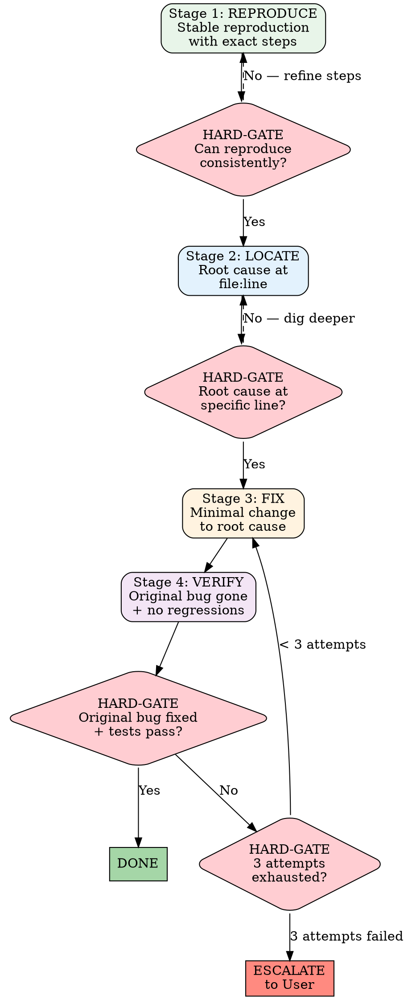
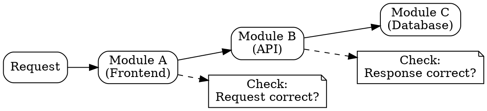

# Systematic Debugging

## <EXTREMELY-IMPORTANT>Iron Law</EXTREMELY-IMPORTANT>

**NO FIX SHALL BE ATTEMPTED WITHOUT FIRST REPRODUCING THE BUG AND LOCATING THE ROOT CAUSE TO A SPECIFIC FILE AND LINE NUMBER.**

Guessing is not debugging. Changing code without understanding why it's broken creates more bugs than it fixes.

---

## Four-Stage Debugging Protocol



---

## Stage 1: REPRODUCE

**Goal: Reliably trigger the bug with documented steps.**

### Reproduction Checklist

- [ ] Exact steps to trigger the bug (numbered list)
- [ ] Expected behavior (what should happen)
- [ ] Actual behavior (what happens instead)
- [ ] Error message (full text, not paraphrased)
- [ ] Stack trace (if available)
- [ ] Environment details (browser, Node version, OS)
- [ ] Frequency: always / sometimes / once

### HARD-GATE: Reproduction Verified

The bug must be triggered at least once with your documented steps before proceeding. If you cannot reproduce it:

1. Check if the environment differs (dev vs. production)
2. Check if the data state matters (empty DB vs. seeded)
3. Check if timing matters (race condition?)
4. Ask the user for more details

**Never proceed to Stage 2 without a confirmed reproduction.**

---

## Stage 2: LOCATE

**Goal: Identify the root cause at a specific file and line number.**

### Locating Strategy

```
1. Read the error message / stack trace carefully
2. Identify the module boundary where the error occurs
3. Trace the execution path from entry point to error
4. Narrow down to the specific function / line
5. Understand WHY the code fails, not just WHERE
```

### Cross-Module Bug Diagnosis

When the bug spans module boundaries:



**Strategy: Verify data at each module boundary.**

1. Is the request from Module A correct? (check payload)
2. Is Module B processing it correctly? (check service logic)
3. Is Module C returning correct data? (check query + result)

The bug is at the boundary where correct input produces incorrect output.

### Platform API Bug Special Handling

When the bug involves a platform API:

1. **Check quirks file first**: `knowledge/platforms/platform-{name}.md`
2. **Make a raw API request**: Bypass your code, hit the API directly
3. **Compare**: Does raw response match what your code processes?
4. **Document**: If it's a platform quirk, add it to the quirks file

### HARD-GATE: Root Cause Located

Before proceeding to fix, you must state:

```
Root cause: {file}:{line} — {explanation of why this code is wrong}
```

Not acceptable:
- "The problem is somewhere in the order module"
- "It might be a race condition"
- "Probably a type mismatch"

Acceptable:
- "`server/src/services/orders.ts:142` — the WHERE clause is missing tenantId, allowing cross-tenant data leakage"
- "`client/src/pages/orders/OrderList.tsx:87` — the useEffect dependency array is empty, so the filter state change doesn't trigger a re-fetch"

---

## Stage 3: FIX

**Goal: Minimal change that fixes the root cause.**

### Fix Rules

1. **Fix the root cause, not the symptom.** If the query returns wrong data, fix the query — don't filter the results in the frontend.
2. **Minimal change.** Only modify what's necessary. Don't refactor surrounding code during a bug fix.
3. **One fix at a time.** If you find multiple bugs, fix them separately with separate verifications.

### Three-Fix Rule

```
Fix attempt 1 → Verify → Pass? → Done
                       → Fail? → Fix attempt 2 → Verify → Pass? → Done
                                                        → Fail? → Fix attempt 3 → Verify → Pass? → Done
                                                                                          → Fail? → ESCALATE
```

**After 3 failed fix attempts, stop and question the architecture itself.** The problem may not be a bug — it may be a design flaw that requires a different approach.

When escalating, provide:
1. What you've tried (3 attempts with results)
2. Why each attempt failed
3. Your hypothesis about the underlying issue
4. Proposed alternative approaches

---

## Stage 4: VERIFY

**Goal: Confirm the bug is fixed AND nothing else broke.**

### Verification Checklist

- [ ] Original reproduction steps no longer trigger the bug
- [ ] `npm test` passes with zero new failures
- [ ] No regressions in related functionality
- [ ] Edge cases tested (empty data, boundary values, concurrent access)

### Evidence Requirements (Reference: `skills/verification-before-completion.md`)

| Claim | Required Evidence |
|-------|-------------------|
| "Bug is fixed" | Original repro steps produce correct behavior |
| "Tests pass" | `npm test` output with pass/fail counts |
| "No regression" | Full test suite output |
| "API works" | curl request + response |
| "UI works" | Browser verification |

---

## Anti-Rationalization Defense

| # | Agent Says | Reality | Defense |
|---|-----------|---------|---------|
| 1 | "I know where the bug is" | Without reproduction, you're guessing | Stage 1 is mandatory — reproduce first |
| 2 | "Let me just fix it and see" | Blind fixes create more bugs | Stage 2 is mandatory — locate root cause |
| 3 | "Works in test environment" | Production conditions differ | Verify with production-like data/config |
| 4 | "Changing one line can't break anything" | `npm test` is the judge, not intuition | Run full test suite after every change |
| 5 | "A restart fixed it" | Root cause is still there, will recur | Restart is not a fix — find the cause |
| 6 | "It's the third-party API's fault" | Eliminate your code first | Make raw API request to verify |

Reference: `skills/anti-rationalization.md` for the complete defense framework.

---

## Red Flag Checklist

Stop and reassess if you catch yourself:

- [ ] Changing code without first reproducing the bug
- [ ] Saying "it might be" or "probably" without evidence
- [ ] Making multiple changes at once ("shotgun debugging")
- [ ] Fixing the symptom instead of the root cause
- [ ] Skipping `npm test` after a fix
- [ ] On your 4th fix attempt without escalating
- [ ] Adding a try-catch to suppress an error instead of fixing it
- [ ] Saying "it works now" without running the original repro steps

---

## Good vs Bad Debugging

### Good: Systematic Approach

```
1. REPRODUCE: "Click 'Create Order' with empty cart → 500 error"
   Steps documented, reproducible every time.

2. LOCATE: server/src/services/orders.ts:89
   createOrder() doesn't check for empty items array.
   SQL INSERT fails on NOT NULL constraint for order_items.

3. FIX: Add validation at service layer:
   if (!items.length) throw new ValidationError('Order must have items')
   (3 lines changed)

4. VERIFY:
   - Empty cart → 400 with clear message ✓
   - Normal cart → order created ✓
   - npm test → 47 passed, 0 failed ✓
```

### Bad: Shotgun Approach

```
1. "500 error on create order"
2. "Let me add try-catch around the create function"
3. Error is now swallowed, returns empty response
4. "Let me also add null checks everywhere"
5. 15 files changed, original bug masked, 3 new bugs introduced
6. "I think it's fixed now"
```

The good approach takes 20 minutes and solves the problem. The bad approach takes 2 hours and makes things worse.

---

*Debug with evidence, not intuition. The bug doesn't care what you think — only what the code does.*
