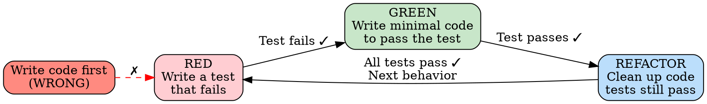

# Test-Driven Development

## <EXTREMELY-IMPORTANT>Iron Law</EXTREMELY-IMPORTANT>

**NO PRODUCTION CODE WITHOUT A FAILING TEST FIRST. THE TEST DEFINES THE BEHAVIOR. THE CODE MAKES THE TEST PASS. THIS ORDER IS NON-NEGOTIABLE.**

If you write the code first, the test only proves you can read your own code. If you write the test first, the test proves the code works.

---

## RED-GREEN-REFACTOR Cycle



### The Cycle in Practice

```
1. RED: Write a test for the next behavior you want to implement
   → Run it → It MUST fail (if it passes, the test is wrong or the behavior already exists)

2. GREEN: Write the MINIMUM code to make the test pass
   → No more, no less. Don't implement features the test doesn't require.

3. REFACTOR: Clean up the code while keeping all tests green
   → Improve structure, remove duplication, clarify names
   → Run tests after EVERY refactoring step
```

---

## ERP-Specific Test Patterns

### Pattern 1: Multi-Tenant Isolation

Every data-access function must be tested for tenant isolation.

```typescript
// TEST (written first)
describe('Order Service - Tenant Isolation', () => {
  it('tenant A cannot see tenant B orders', async () => {
    // Arrange: Create order for tenant A
    const orderA = await orderService.create({
      tenantId: TENANT_A,
      items: [{ skuId: 'SKU-1', quantity: 1 }],
    });

    // Act: Query as tenant B
    const ordersB = await orderService.list({ tenantId: TENANT_B });

    // Assert: Tenant B sees nothing
    expect(ordersB.items).not.toContainEqual(
      expect.objectContaining({ id: orderA.id })
    );
  });

  it('tenant B cannot update tenant A order', async () => {
    const orderA = await orderService.create({
      tenantId: TENANT_A,
      items: [{ skuId: 'SKU-1', quantity: 1 }],
    });

    await expect(
      orderService.update({
        tenantId: TENANT_B,
        id: orderA.id,
        status: 'cancelled',
      })
    ).rejects.toThrow(); // 404 or Forbidden
  });
});
```

### Pattern 2: Platform API Mock (5-Path)

Every platform API interaction must be tested with 5 paths.

```typescript
describe('eBay Order Sync', () => {
  // Path 1: Happy path
  it('syncs orders successfully', async () => {
    mockApi.onGet('/orders').reply(200, fixtures.validOrdersResponse);
    const result = await ebaySync.pullOrders();
    expect(result.synced).toBe(3);
    expect(result.errors).toHaveLength(0);
  });

  // Path 2: Error response
  it('handles API error gracefully', async () => {
    mockApi.onGet('/orders').reply(400, { error: 'INVALID_PARAM' });
    const result = await ebaySync.pullOrders();
    expect(result.synced).toBe(0);
    expect(result.errors[0].code).toBe('PLATFORM_ERROR');
  });

  // Path 3: Auth failure
  it('triggers token refresh on 401', async () => {
    mockApi.onGet('/orders').replyOnce(401);
    mockApi.onGet('/orders').reply(200, fixtures.validOrdersResponse);
    const result = await ebaySync.pullOrders();
    expect(tokenRefreshSpy).toHaveBeenCalledOnce();
    expect(result.synced).toBe(3);
  });

  // Path 4: Rate limit
  it('retries with backoff on 429', async () => {
    mockApi.onGet('/orders').replyOnce(429, null, { 'Retry-After': '2' });
    mockApi.onGet('/orders').reply(200, fixtures.validOrdersResponse);
    const result = await ebaySync.pullOrders();
    expect(result.synced).toBe(3);
    expect(delaySpy).toHaveBeenCalledWith(2000);
  });

  // Path 5: Timeout
  it('handles timeout gracefully', async () => {
    mockApi.onGet('/orders').timeout();
    const result = await ebaySync.pullOrders();
    expect(result.synced).toBe(0);
    expect(result.errors[0].code).toBe('TIMEOUT');
  });
});
```

### Pattern 3: Financial Precision

Every financial calculation must be tested for precision.

```typescript
describe('Accounting - Journal Entry', () => {
  it('debits equal credits', async () => {
    const entry = await accounting.createJournalEntry({
      tenantId: TENANT_A,
      lines: [
        { account: 'revenue', type: 'credit', amount: '199.99' },
        { account: 'cash', type: 'debit', amount: '199.99' },
      ],
    });

    const debits = entry.lines
      .filter(l => l.type === 'debit')
      .reduce((sum, l) => sum + parseFloat(l.amount), 0);
    const credits = entry.lines
      .filter(l => l.type === 'credit')
      .reduce((sum, l) => sum + parseFloat(l.amount), 0);

    expect(debits).toBe(credits);
  });

  it('handles multi-currency with correct precision', async () => {
    // JPY has 0 decimal places, USD has 2
    const converted = await fx.convert({
      amount: '1000',
      from: 'JPY',
      to: 'USD',
      rate: '0.00671',
    });

    expect(converted).toBe('6.71'); // 2 decimal places for USD
    expect(converted).not.toBe('6.710'); // No trailing zeros
  });

  it('rejects unbalanced journal entries', async () => {
    await expect(
      accounting.createJournalEntry({
        tenantId: TENANT_A,
        lines: [
          { account: 'revenue', type: 'credit', amount: '100.00' },
          { account: 'cash', type: 'debit', amount: '99.99' },
        ],
      })
    ).rejects.toThrow('Journal entry must balance');
  });
});
```

### Pattern 4: State Machine Transitions

Every state machine must be tested for both valid and invalid transitions.

```typescript
describe('Order State Machine', () => {
  // Valid transitions
  it.each([
    ['pending', 'confirmed', 'confirm'],
    ['confirmed', 'processing', 'startProcessing'],
    ['processing', 'shipped', 'ship'],
    ['shipped', 'delivered', 'deliver'],
    ['pending', 'cancelled', 'cancel'],
  ])('allows %s → %s via %s', async (from, to, action) => {
    const order = await createOrderInState(from);
    const result = await orderService[action](order.id);
    expect(result.status).toBe(to);
  });

  // Invalid transitions
  it.each([
    ['shipped', 'cancelled', 'cancel'],
    ['delivered', 'processing', 'startProcessing'],
    ['cancelled', 'confirmed', 'confirm'],
  ])('rejects %s → %s via %s', async (from, to, action) => {
    const order = await createOrderInState(from);
    await expect(orderService[action](order.id))
      .rejects.toThrow(/invalid transition/i);
  });
});
```

---

## Anti-Rationalization Defense

| # | Agent Says | Reality | Defense |
|---|-----------|---------|---------|
| 1 | "Too simple to test" | 30 seconds to write, catches real bugs | Write it. Simple tests have saved production. |
| 2 | "Tests after code works the same" | Post-hoc tests only prove you can read your code | Pre-written test = spec. Post-written test = rubber stamp. |
| 3 | "Deleting working code is wasteful" | Sunk cost fallacy. Tests define what "working" means. | If the test says delete it, delete it. |
| 4 | "Integration test covers it" | Integration tests are slow and don't pinpoint failures | Unit tests catch issues in seconds, not minutes. |
| 5 | "Mock is too complex" | Test the interface, not the implementation | Simplify the interface, not the test. |
| 6 | "Will add tests later" | Later never comes. The PR ships without tests. | RED phase is step 1. No exceptions. |

Reference: `skills/anti-rationalization.md` for the complete defense framework.

---

## Red Flag Checklist

Stop and reassess if you catch yourself:

- [ ] Writing production code before a failing test exists
- [ ] Writing a test that passes on the first run (test is wrong or behavior exists)
- [ ] Writing more production code than the test requires
- [ ] Skipping the REFACTOR step ("it works, don't touch it")
- [ ] Testing only happy paths
- [ ] Using `as any` in test code to make types fit
- [ ] Writing tests that depend on execution order
- [ ] Mocking so heavily that the test doesn't test anything real

---

## Good vs Bad TDD

### Good: Test-First for Order Creation

```
RED:   Write test: createOrder with valid items → returns order with status 'pending'
       Run test → FAILS (createOrder doesn't exist yet) ✓

GREEN: Implement createOrder → minimum code to pass
       Run test → PASSES ✓

RED:   Write test: createOrder with empty items → throws ValidationError
       Run test → FAILS ✓

GREEN: Add validation check
       Run test → PASSES ✓

RED:   Write test: createOrder with wrong tenantId → order not visible to other tenant
       Run test → FAILS ✓

GREEN: Add tenantId to query
       Run test → PASSES ✓

REFACTOR: Extract validation to separate function
          Run ALL tests → ALL PASS ✓
```

### Bad: Code-First with Afterthought Tests

```
1. Write entire createOrder function (100 lines)
2. Write test that calls createOrder and checks it returns something
3. Test passes on first run (!)
4. "Tests done" ← These tests prove nothing
5. Production: empty items crash, tenant data leaks
```

The good approach: 6 cycles, 3 behaviors verified, bulletproof.
The bad approach: 1 rubber-stamp test, 0 edge cases, production bugs.

---

*The test is the first user of your code. Write for that user before any other.*
