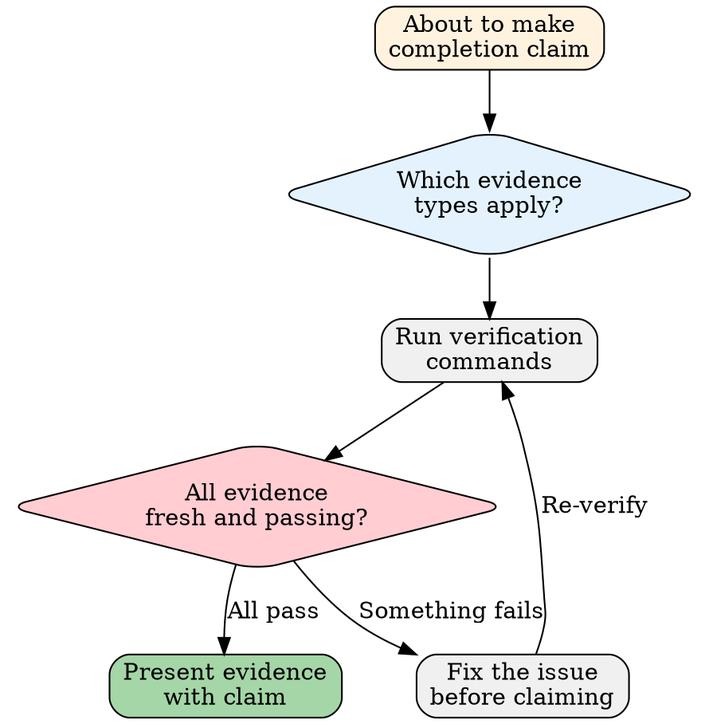

# Verification Before Completion

## Key Principle

**No completion claims without fresh verification evidence.** "Should work" is not evidence. "Looks good" is not evidence. Only terminal output, curl responses, and browser verification are evidence.

If you can't paste the proof, you can't make the claim.

## Why This Matters for ERP

ERP systems handle real money and real orders. "It probably works" is not acceptable when a bug means shipping the wrong product or double-charging a customer. A verified order export endpoint takes 30 minutes. An unverified one that leaks cross-tenant data takes weeks to clean up — plus the trust damage with affected customers.

---

## Evidence Requirements

### The 8 Evidence Types

Every completion claim MUST be backed by the corresponding evidence type:

| # | Claim | Required Evidence | Acceptable Format |
|---|-------|-------------------|-------------------|
| 1 | "tsc passes" | Terminal output of `npx tsc --noEmit` | Zero errors in output |
| 2 | "Tests pass" | `npm test` output | Pass/fail counts visible |
| 3 | "API works" | curl command + full response | HTTP status + response body |
| 4 | "Page renders" | Browser verification or console log | Screenshot or dev tools output |
| 5 | "Field names verified" | Real API response JSON snippet | Actual field names visible |
| 6 | "No impact on other modules" | `npm test` full suite output | All modules pass |
| 7 | "Tenant isolation handled" | CC-3 checklist completed | All 6 items checked |
| 8 | "Knowledge updated" | `git diff` showing knowledge files | File changes visible |

### Evidence Freshness Rule

Evidence must be from the CURRENT state of the code. Evidence from before your latest change is stale and invalid.

```
✗ "tsc passed before I made this change" → Stale. Run again.
✗ "Tests passed yesterday" → Stale. Run again.
✗ "It worked when I tested the other endpoint" → Different endpoint. Test this one.
✓ "Here's the tsc output AFTER my last edit: [output]" → Fresh.
```

---

## Forbidden Language

### Words That Trigger This Skill

If you are about to use any of these words in a completion statement, STOP and get evidence first:

| Forbidden | Why | Replace With |
|-----------|-----|-------------|
| "should work" | Speculation, not verification | "Here's the test output showing it works: ..." |
| "probably fine" | Probability is not proof | "Verified with curl: ..." |
| "looks correct" | Visual inspection is unreliable | "tsc output confirms zero errors: ..." |
| "I believe" | Belief is not evidence | "npm test shows 47/47 passing: ..." |
| "likely" | Likelihood is not certainty | Run the verification and show results |
| "seems to" | Seeming is not being | Concrete output or it didn't happen |
| "should be" | Should ≠ is | Prove it IS, not that it SHOULD BE |

### Forbidden Satisfaction Expressions

Do NOT express satisfaction or completion before verification:

```
✗ "Great, that's done!"          → Before or after verification?
✗ "Perfect, everything works!"   → Show the evidence.
✗ "That should fix it!"          → Did it? Run the test.
✗ "The feature is complete!"     → Checklist says otherwise.
```

Express satisfaction ONLY after presenting fresh verification evidence.

---

## ERP-Specific Verification Checklists

### Tenant Isolation Verification (Reference: `protocols/cross-cutting-checks.md` CC-3)

Before claiming any data-related work is complete:

- [ ] Every new query includes `WHERE tenantId = ?`
- [ ] RLS policies created for new tables
- [ ] Cross-tenant test: Tenant A data invisible to Tenant B
- [ ] JOIN queries filter tenantId on ALL joined tables
- [ ] Bulk operations scoped to single tenant
- [ ] No raw SQL without tenant filter

### Multi-Platform Compatibility (Reference: `protocols/cross-cutting-checks.md` CC-4)

Before claiming platform-related work is complete:

- [ ] Tested with at least 2 different platform's data
- [ ] Field mappings verified against real API responses
- [ ] Error codes properly mapped (upstream 401 → 502)
- [ ] Rate limiting handled per-platform
- [ ] Platform-specific quirks documented

### Financial Precision (Reference: `protocols/cross-cutting-checks.md` CC-5)

Before claiming any financial/accounting work is complete:

- [ ] Debits equal credits (journal entry balance)
- [ ] Decimal precision matches business requirements (no floating point)
- [ ] Multi-currency conversions use correct rate and rounding
- [ ] Integer values don't produce decimals in display
- [ ] Totals recomputed, not stored redundantly (or if stored, reconciled)

---

## Verification Protocol

### Step-by-Step Process



### Example: Claiming "Feature Complete"

```
Claim: "The order list page is complete"

Required evidence:
1. tsc: npx tsc --noEmit → 0 errors ✓
2. Tests: npm test → 52/52 passing ✓
3. API: curl GET /api/v1/orders → 200 with correct data ✓
4. Browser: Page loads, data displays, filters work ✓
5. Tenant: Tenant A sees only their orders ✓
6. Knowledge: git diff shows updated API docs ✓

NOW I can say: "The order list page is complete. Evidence above."
```

---

## Common Traps

### The "Last Change Was Trivial" Trap

```
"I only changed a comment, no need to re-run tests"
→ Wrong. You might have accidentally changed code too. Run the tests.
```

### The "It Compiled" Trap

```
"tsc passes, so the feature works"
→ Wrong. tsc checks types, not behavior. Curl the endpoint.
```

### The "Tests Pass" Trap

```
"All tests pass, so the feature is complete"
→ Maybe. Are there tests for what you just built? Or only pre-existing tests?
```

### The "It Worked Before" Trap

```
"This endpoint worked when I tested it earlier"
→ Before or after your latest changes? Re-test.
```

---

## ERP Delivery Risks

| Risk | What Goes Wrong | Prevention |
|------|----------------|------------|
| Stale evidence | Verified before last change, not after | Evidence must be FRESH — from current code state |
| Compilation-only verification | tsc checks types, not business logic | Also need curl + browser verification |
| Assumed test coverage | New code may not be covered by existing tests | Show the test output for new code paths |
| "Trivial change" skips verification | Trivial changes cascade in ERP — one field rename breaks sync | No exceptions to verification |
| Unverified tenant isolation | "Added tenantId" but missed a JOIN or subquery | Complete CC-3 checklist, not a spot check |

Reference: `skills/anti-rationalization.md` for the complete risk catalog.

---

## Red Flag Checklist

Stop and get evidence if you catch yourself:

- [ ] About to say "done" without terminal output in hand
- [ ] Using "should", "probably", "likely" in a completion statement
- [ ] Expressing satisfaction before presenting evidence
- [ ] Relying on evidence from before your last code change
- [ ] Claiming tenant isolation "is handled" without the CC-3 checklist
- [ ] Claiming "no regression" without full test suite output
- [ ] Saying "the fix works" without re-running the original reproduction steps

---

## Good vs Bad Completion Claims

### Good

```
"Order list API is complete.

Evidence:
- tsc: 0 errors (output attached)
- npm test: 52/52 passing (output attached)
- curl GET /api/v1/orders: 200, returns paginated results (output attached)
- curl GET /api/v1/orders with wrong tenantId: returns empty array ✓
- Browser: page loads, filters work, pagination works (verified)
- Knowledge: API docs updated (git diff attached)"
```

### Bad

```
"Order list API should be complete. I've added the routes and service
layer. tsc passes so it should work. Let me know if there are issues."
```

The good claim is verifiable. The bad claim is a prayer.

---

*Verification is not overhead. Verification is the work.*
